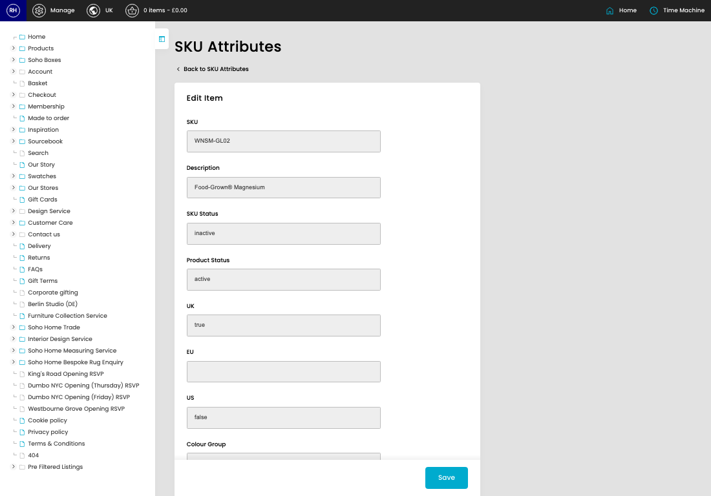

# SKU Attributes

[Home](../../index.md) / [SKU Attributes](../191-cp-stockitems-attributes-admin-e0143b2a/README.md) / Edit SKU Attribute

URL: [https://sohohome.com/cp/stockitems-attributes-admin/edit/:id](https://sohohome.com/cp/stockitems-attributes-admin/edit/:id)

Use this screen when you need to check or change an existing SKU attribute.

*SKU Attributes page overview*

## Related Pages

- [SKU Attributes](../191-cp-stockitems-attributes-admin-e0143b2a/README.md): Search or filter the visible fields to find the SKU attribute you need.

## How It Works

- The key fields are SKU, Description, SKU Status, Product Status, and UK, which explain what the record is for and how it can be used.

## Using This Page

1. Open the existing SKU attribute you need to change.
2. Work through the fields that are relevant to the change.
3. Save once the details are correct.

## What You Can Do

### Edit an existing SKU attribute

Open an existing SKU attribute when you need to check the setup or make a change.

- Save once the details are correct.
