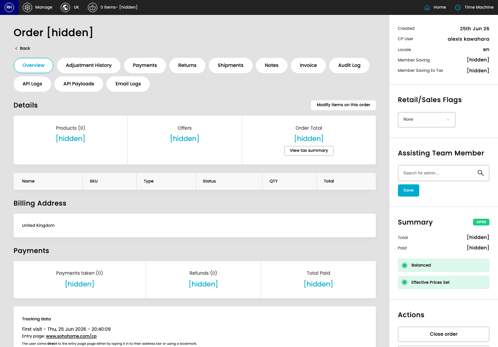
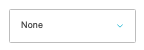

# Orders

[Home](../../index.md) / [Orders](../193-cp-store-admin-998dd625/README.md) / View Order

URL: [https://sohohome.com/cp/store-admin/show/:id](https://sohohome.com/cp/store-admin/show/:id)

Additional home specific store admin functionality

*Orders page overview*

## Related Pages

- [Orders](../193-cp-store-admin-998dd625/README.md): Search or filter the visible fields to find the order you need.

## Using This Page

1. Search or filter until you find the order you need.
2. Open a row when you need to check the full details.

## What You Can Do

### Review orders

Search or filter the visible fields to find the order you need, then open the row to check the full details.

- Visible fields include Name, SKU, Type, Status, QTY, and Total.

### Review an existing order

Open an existing order when you need to check the full details.

## Key Settings

### Orders

#### select_retail_flag

*select_retail_flag setting*

Choose the option that matches this select_retail_flag.

**Options:** None, Amsterdam, Austin, Bicester, Berlin, Carnaby, Chicago Studio, Dumbo, Kings Road, Melrose, Miami Beach House, Nashville, and 8 more

#### Search for admin...

*Search for admin... setting*

Use the expected format shown by the placeholder: "Search for admin...".

## Page Sections

- Overview
- Adjustment History
- Payments
- Returns
- Shipments
- Notes
- Invoice
- Audit Log
- API Logs
- API Payloads
- Email Logs
- Modify items on this order
- View tax summary
- Close order
- Resend Order Confirmation
- Update Effective Prices
- Create New Basket from Order
- Send to Business Central
- Generate Sales Receipt
- Mark as Skip Stock Check
- Mark as VIP
- Mark As Interior Design
