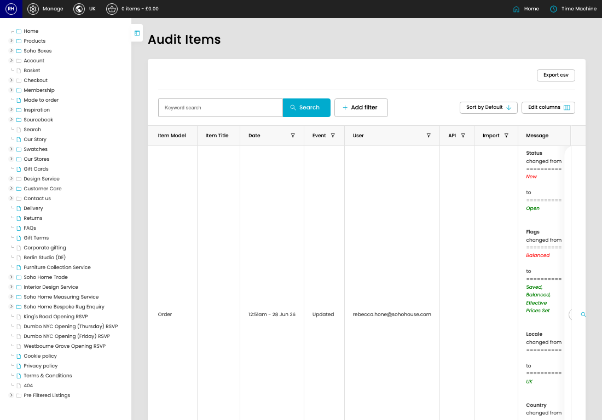

# Structured Audit

[Home](../../index.md) / Structured Audit

URL: [https://sohohome.com/cp/structured-audit-admin](https://sohohome.com/cp/structured-audit-admin)

Structured Audit covers the admin screen used to review and maintain structured audit.

*Structured Audit page overview*

## Related Pages

- [View Structured Audit](../196-cp-structured-audit-admin-view-24747344-7a039e8e/README.md): Open an existing structured audit when you need to check the full details.

## How It Works

- The key fields are Audit ID, Audit Log, Item Model, Item Title, and Item ID, which explain what the record is for and how it can be used.

## Using This Page

1. Open Structured Audit from the CP navigation.
2. Search or filter until you find the structured audit you need.

## What You Can Do

### Review structured audit

Search or filter the visible fields to find the structured audit you need.

- Field: Item Model
- Field: Item Title
- Field: Date
- Field: Event
- Field: User
- Field: API
- Field: Import
- Field: Message

Example rows:

| Item Model | Item Title | Date | Event | User | API |
| --- | --- | --- | --- | --- | --- |
| Order |  | 12:51am - 28 Jun 26 | Updated | rebecca.hone@sohohouse.com |  |
| Customer | Stephanie Thill | 1:04am - 26 Jun 26 | Updated |  |  |
| Customer | Daniela Schmetzer | 1:04am - 26 Jun 26 | Updated |  |  |
