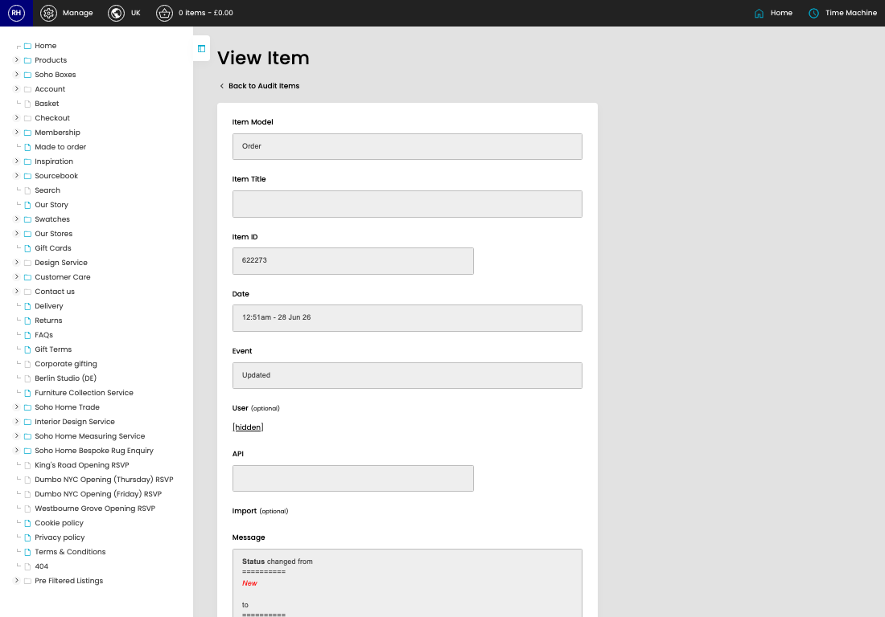

# Structured Audit

[Home](../../index.md) / [Structured Audit](../195-cp-structured-audit-admin-f4fe2120/README.md) / View Structured Audit

URL: [https://sohohome.com/cp/structured-audit-admin/view/:id](https://sohohome.com/cp/structured-audit-admin/view/:id)

Structured Audit shows the details for this structured audit.

*Structured Audit page overview*

## Related Pages

- [Structured Audit](../195-cp-structured-audit-admin-f4fe2120/README.md): Search or filter the visible fields to find the structured audit you need.

## How It Works

- The key fields are Audit ID, Audit Log, Item Model, Item Title, and Item ID, which explain what the record is for and how it can be used.

## Using This Page

1. Open the existing structured audit you need to review.
2. Use the visible fields to check the details.

## What You Can Do

### Review an existing structured audit

Open an existing structured audit when you need to check the full details.
