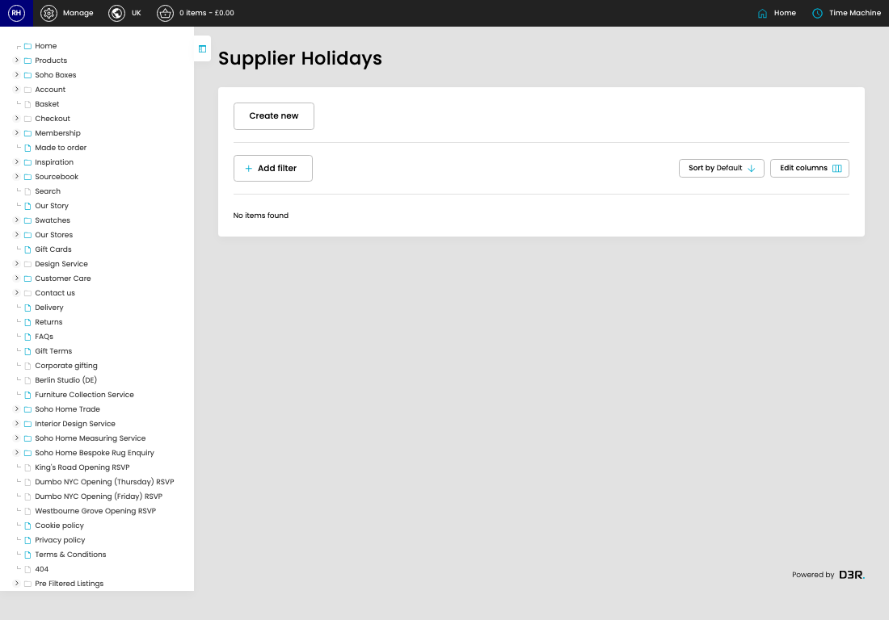

# Supplier Holidays

[Home](../../index.md) / Supplier Holidays

URL: [https://sohohome.com/cp/supplier-holidays-admin](https://sohohome.com/cp/supplier-holidays-admin)

MTO supplier holiday periods tracks closure dates for suppliers (e.g. christmas, TET, CNY) extra days are added to MTO lead times when the production window overlaps the holiday

*Supplier Holidays page overview*

## Related Pages

- [Create Supplier Holiday](../198-cp-supplier-holidays-admin-edit-new-9c01f78f/README.md): Use Create new when this supplier holiday does not already exist. Complete the fields that describe it, then save.

## How It Works

- Makes sure the transfer property is set appropriately.
- The key fields are Title, Date From, Date To, Buffer Days, and Enabled, which explain what the record is for and how it can be used.

## Using This Page

1. Open the Supplier Holidays screen.
2. Use the visible fields to check the details.
