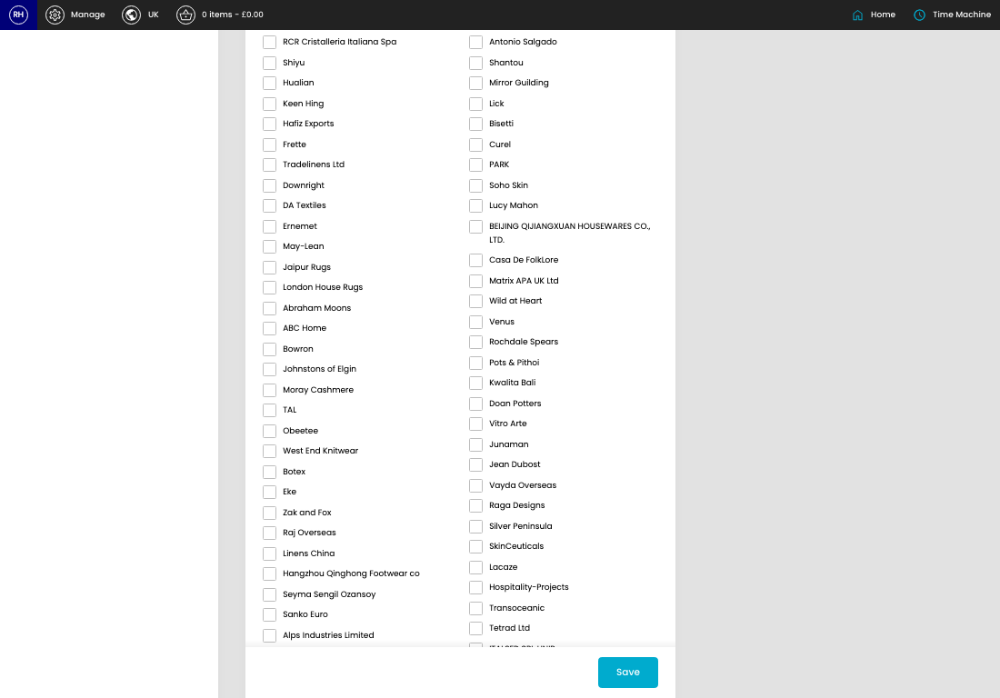

# Supplier Holidays

[Home](../../index.md) / Create Supplier Holiday

URL: [https://sohohome.com/cp/supplier-holidays-admin/edit/new](https://sohohome.com/cp/supplier-holidays-admin/edit/new)

Supplier Holidays covers the admin screen used to review and maintain supplier holidays.

*Supplier Holidays page overview*

## Related Pages

- [Supplier Holidays](../198-cp-supplier-holidays-admin-298f7ec1/README.md): Supplier Holidays covers the admin screen used to review and maintain supplier holidays.

## How It Works

- Makes sure the transfer property is set appropriately.
- The key fields are Title, Date From, Date To, Buffer Days, and Enabled, which explain what the record is for and how it can be used.

## Using This Page

1. Create the new supplier holiday from this screen.
2. Work through the fields that are relevant to the new record.
3. Save once the details are correct.

## What You Can Do

### Create a new supplier holiday

Use Create new when this supplier holiday does not already exist. Complete the fields that describe it, then save.

### Update settings

Use the fields on this screen to make the change, then save once the values are correct.

## Key Settings

The sections below highlight the settings people are most likely to change.

### Create New Supplier Holiday

#### Title

*Title setting*

Add the title.

**Validation:** Required.

#### Date From

*Date From setting*

Add the date from.

#### Date To

*Date To setting*

Add the date to.

#### Buffer Days (optional)

*Buffer Days (optional) setting*

Add the buffer days (optional).

**Notes:** Extra buffer days added after the holiday period (e.g. ramp-up time)

#### Enabled

*Enabled setting*

Turn this on when enabled should apply. Leave it off when it should not.

#### ACV

*ACV setting*

Turn this on when ACV should apply. Leave it off when it should not.

**Notes:** Leave empty to apply to all suppliers

#### Faianças Ramos

*Faianças Ramos setting*

Turn this on when faianças ramos should apply. Leave it off when it should not.

**Notes:** Leave empty to apply to all suppliers

#### Anthropologie

*Anthropologie setting*

Turn this on when anthropologie should apply. Leave it off when it should not.

**Notes:** Leave empty to apply to all suppliers

#### Culinary Concepts

Turn this on when culinary concepts should apply. Leave it off when it should not.

**Notes:** Leave empty to apply to all suppliers

#### Dynatech Exports

Turn this on when dynatech exports should apply. Leave it off when it should not.

**Notes:** Leave empty to apply to all suppliers

#### Chung Mao

Turn this on when chung mao should apply. Leave it off when it should not.

**Notes:** Leave empty to apply to all suppliers

#### Newgate

Turn this on when newgate should apply. Leave it off when it should not.

**Notes:** Leave empty to apply to all suppliers

#### Eastern Living International

Turn this on when eastern living international should apply. Leave it off when it should not.

**Notes:** Leave empty to apply to all suppliers

#### Reliance Enterprise

Turn this on when reliance enterprise should apply. Leave it off when it should not.

**Notes:** Leave empty to apply to all suppliers

#### Charles Farris

Turn this on when charles farris should apply. Leave it off when it should not.

**Notes:** Leave empty to apply to all suppliers

#### Zound Industries

Turn this on when zound industries should apply. Leave it off when it should not.

**Notes:** Leave empty to apply to all suppliers

#### Archivist Gallery

Turn this on when archivist gallery should apply. Leave it off when it should not.

**Notes:** Leave empty to apply to all suppliers

#### Gayatri

Turn this on when gayatri should apply. Leave it off when it should not.

**Notes:** Leave empty to apply to all suppliers

#### Brass World Export

Turn this on when brass world export should apply. Leave it off when it should not.

**Notes:** Leave empty to apply to all suppliers

#### Contract Candles

Turn this on when contract candles should apply. Leave it off when it should not.

**Notes:** Leave empty to apply to all suppliers

#### Ashleigh & Burwood

Turn this on when ashleigh & burwood should apply. Leave it off when it should not.

**Notes:** Leave empty to apply to all suppliers

#### Syloon

Turn this on when syloon should apply. Leave it off when it should not.

**Notes:** Leave empty to apply to all suppliers

#### Phil Dansk

Turn this on when phil dansk should apply. Leave it off when it should not.

**Notes:** Leave empty to apply to all suppliers

#### Jealous

Turn this on when jealous should apply. Leave it off when it should not.

**Notes:** Leave empty to apply to all suppliers
