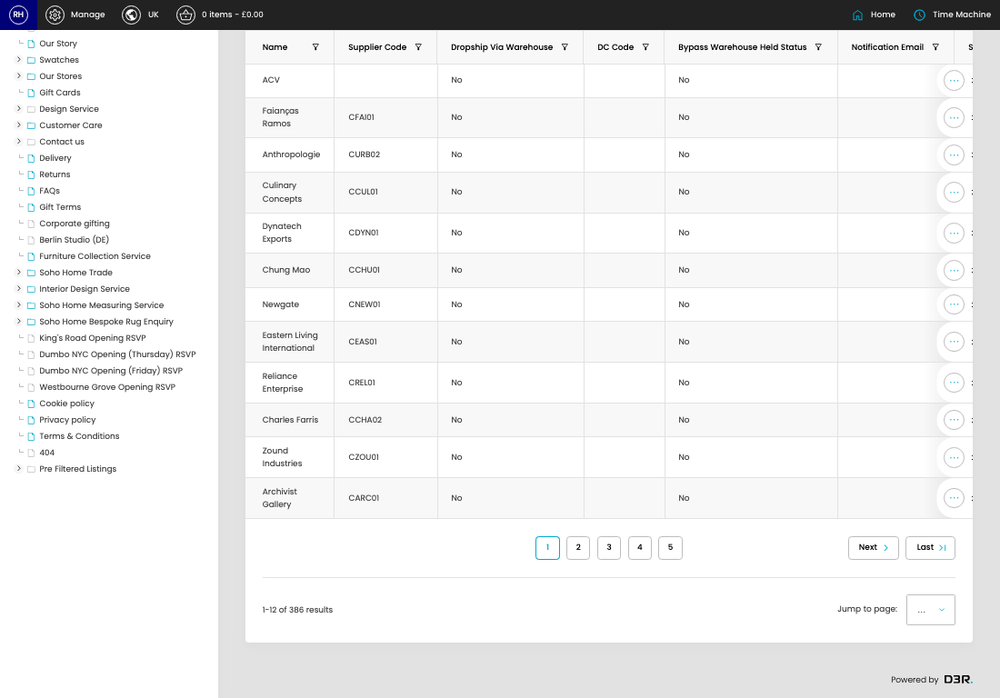

# Suppliers

[Home](../../index.md) / Suppliers

URL: [https://sohohome.com/cp/suppliers-admin](https://sohohome.com/cp/suppliers-admin)

Listing for suppliers

*Suppliers page overview*

## Related Pages

- [Edit Supplier](../201-cp-suppliers-admin-edit-1-6a23bf22/README.md): Open an existing supplier when you need to check the setup or make a change.

## How It Works

- After this has been updated.
- Refresh Action.
- The key fields are Min Lead Days (UK), Max Lead Days (UK), Min Lead Days (EU), Max Lead Days (EU), and Min Lead Days (US), which explain what the record is for and how it can be used.

## Using This Page

1. Open Suppliers from the CP navigation.
2. Search or filter until you find the supplier you need.

## What You Can Do

### Review suppliers

Search or filter the visible fields to find the supplier you need.

- Field: Name
- Field: Supplier Code
- Field: Dropship Via Warehouse
- Field: DC Code
- Field: Bypass Warehouse Held Status
- Field: Notification Email
- Field: Send Dropship Report?
- Field: Line 1
- Field: Postcode

Example rows:

| Name | Supplier Code | Dropship Via Warehouse | DC Code | Bypass Warehouse Held Status | Notification Email |
| --- | --- | --- | --- | --- | --- |
| ACV |  | No |  | No |  |
| Faianças Ramos | CFAI01 | No |  | No |  |
| Anthropologie | CURB02 | No |  | No |  |
