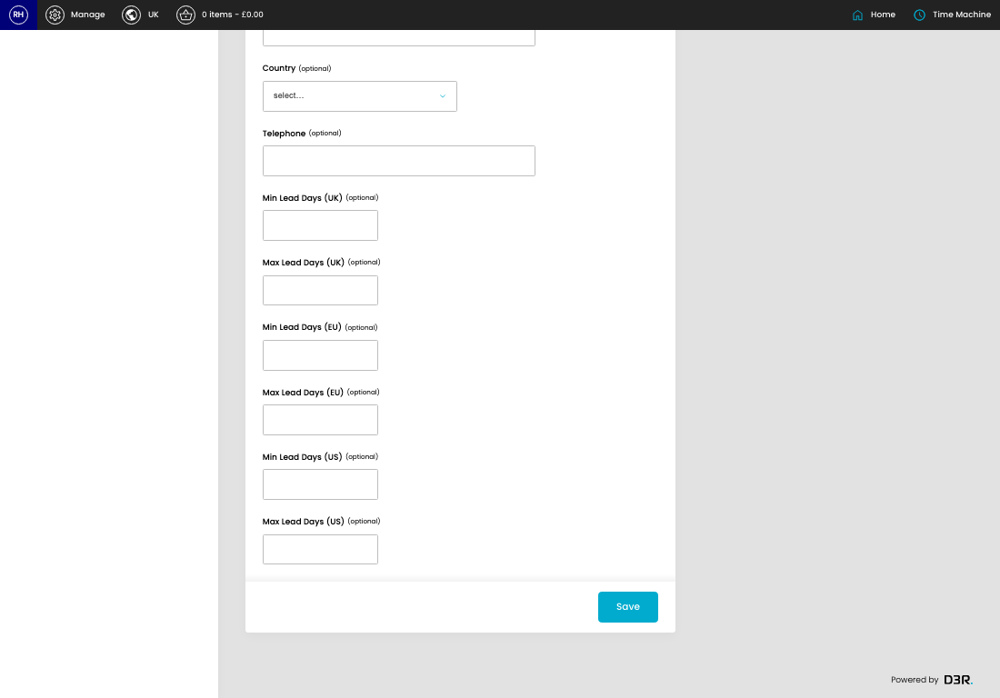
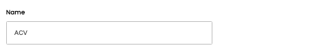
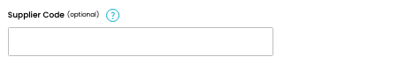
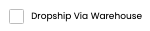
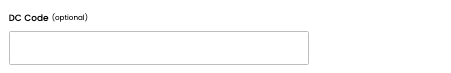
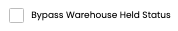
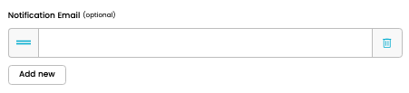

# Suppliers

[Home](../../index.md) / Edit Supplier

URL: [https://sohohome.com/cp/suppliers-admin/edit/1](https://sohohome.com/cp/suppliers-admin/edit/1)

Listing for suppliers

*Suppliers page overview*

## Related Pages

- [Suppliers](../200-cp-suppliers-admin-bd3828fc/README.md): Search or filter the visible fields to find the supplier you need.

## How It Works

- After this has been updated.
- Refresh Action.
- The key fields are Min Lead Days (UK), Max Lead Days (UK), Min Lead Days (EU), Max Lead Days (EU), and Min Lead Days (US), which explain what the record is for and how it can be used.

## Using This Page

1. Open the existing supplier you need to change.
2. Work through the fields that are relevant to the change.
3. Save once the details are correct.

## What You Can Do

### Edit an existing supplier

Open an existing supplier when you need to check the setup or make a change.

- Save once the details are correct.

## Key Settings

### Edit Item

#### Name

*Name setting*

Add the name.

**Validation:** Required.

#### Supplier Code (optional)

*Supplier Code (optional) setting*

Add the supplier code (optional).

**Notes:** optional

#### Dropship Via Warehouse

*Dropship Via Warehouse setting*

Turn this on when dropship via warehouse should apply. Leave it off when it should not.

#### DC Code (optional)

*DC Code (optional) setting*

Add the DC code (optional).

**Notes:** optional

#### Bypass Warehouse Held Status

*Bypass Warehouse Held Status setting*

Turn this on when bypass warehouse held status should apply. Leave it off when it should not.

#### supplier_notification_email[]

*supplier_notification_email[] setting*

Add the supplier_notification_email[].

#### Send Dropship Report?

*Send Dropship Report? setting*

Turn this on when send dropship report? should apply. Leave it off when it should not.

#### First name (optional)

*First name (optional) setting*

Add the first name (optional).

**Notes:** optional

#### Last name (optional)

Add the last name (optional).

**Notes:** optional

#### Line 1 (optional)

Add the line 1 (optional).

**Notes:** optional

#### Line 2 (optional)

Add the line 2 (optional).

**Notes:** optional

#### City (optional)

Add the city (optional).

**Notes:** optional

#### County (optional)

Add the county (optional).

**Notes:** optional

#### State (optional)

Add the state (optional).

**Notes:** optional

#### Postcode (optional)

Add the postcode (optional).

**Notes:** optional

#### Country (optional)

Choose the option that matches this country (optional).

**Options:** United States, ---, Afghanistan, Albania, Algeria, American Samoa, Andorra, Angola, Anguilla, Antarctica, Antigua and Barbuda, Argentina, and 17 more

**Notes:** optional

#### Telephone (optional)

Add the telephone (optional).

**Notes:** optional

#### Min Lead Days (UK) (optional)

Add the min lead days (UK) (optional).

**Notes:** optional

#### Max Lead Days (UK) (optional)

Add the max lead days (UK) (optional).

**Notes:** optional

#### Min Lead Days (EU) (optional)

Add the min lead days (EU) (optional).

**Notes:** optional

#### Max Lead Days (EU) (optional)

Add the max lead days (EU) (optional).

**Notes:** optional

#### Min Lead Days (US) (optional)

Add the min lead days (US) (optional).

**Notes:** optional

#### Max Lead Days (US) (optional)

Add the max lead days (US) (optional).

**Notes:** optional

## Available Actions

- Add new
