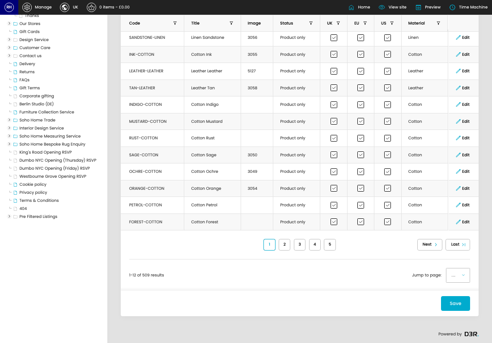

# Swatches

[Home](../../index.md) / Swatches

URL: [https://sohohome.com/cp/swatches](https://sohohome.com/cp/swatches)

Swatches Controller

*Swatches page overview*

## Related Pages

- [Edit Swatche](../203-cp-swatches-edit-1-74e0ebd2/README.md): Open an existing swatche when you need to check the setup or make a change.

## Using This Page

1. Open Swatches from the CP navigation.
2. Search or filter until you find the swatche you need.

## What You Can Do

### Review swatches

Search or filter the visible fields to find the swatche you need.

- Field: Code
- Field: Title
- Field: Image
- Field: Status
- Field: UK
- Field: EU
- Field: US
- Field: Material

Example rows:

| Code | Title | Image | Status | UK | EU |
| --- | --- | --- | --- | --- | --- |
| SANDSTONE-LINEN | Linen Sandstone | 3056 | Product only |  |  |
| INK-COTTON | Cotton Ink | 3055 | Product only |  |  |
| LEATHER-LEATHER | Leather Leather | 5127 | Product only |  |  |

### Update settings

Use the fields on this screen to make the change, then save once the values are correct.

## Key Settings

The sections below highlight the settings people are most likely to change.

### listing-swatch-form

#### Swatch UK

*Swatch UK setting*

Set the Swatch UK value for each relevant row in this section.

#### Swatch EU

*Swatch EU setting*

Set the Swatch EU value for each relevant row in this section.

#### Swatch US

*Swatch US setting*

Set the Swatch US value for each relevant row in this section.

## Available Actions

- Swatches
- Page Content
- SEO
- Header Settings
- Manage Materials
