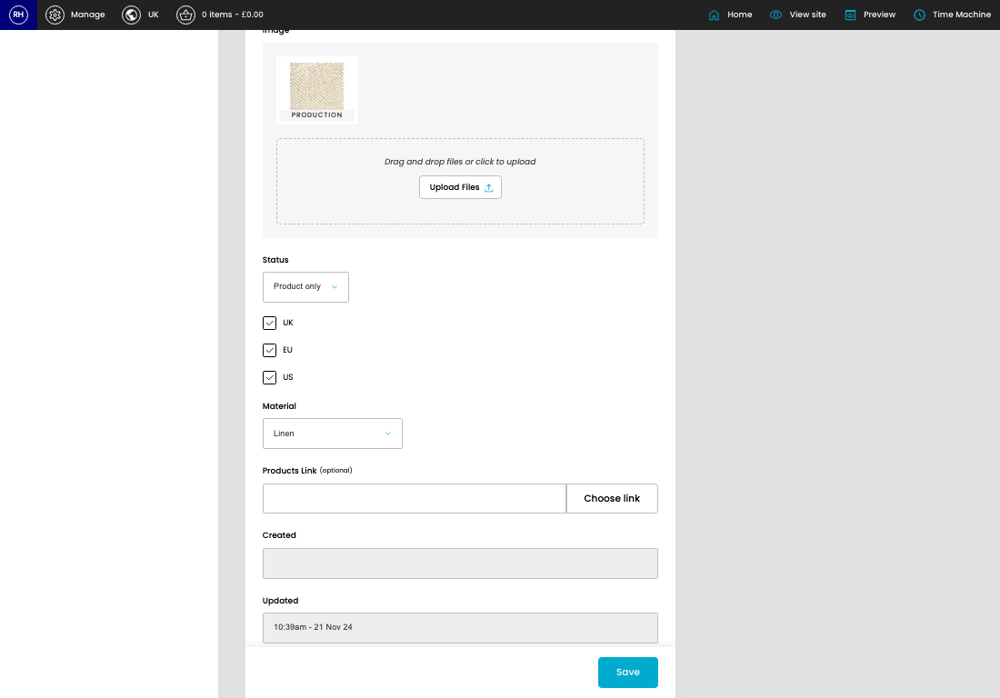
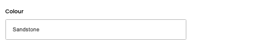
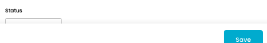

# Swatches

[Home](../../index.md) / [Swatches](../201-cp-swatches-716721cf/README.md) / Edit Swatche

URL: [https://sohohome.com/cp/swatches/edit/:id](https://sohohome.com/cp/swatches/edit/:id)

Swatches manages the swatch records used for fabric, finish, and material sample journeys.

*Swatches page overview*

## Related Pages

- [Swatches](../201-cp-swatches-716721cf/README.md): Search or filter the visible fields to find the swatche you need.

## Using This Page

1. Open the existing swatche you need to change.
2. Work through the fields that are relevant to the change.
3. Save once the details are correct.

## What You Can Do

### Edit an existing swatche

Open an existing swatche when you need to check the setup or make a change.

- Save once the details are correct.

## Key Settings

### Edit Item

#### Code

*Code setting*

Add the code.

**Validation:** Required.

#### Title

*Title setting*

Add the title.

**Validation:** Required.

#### Header Text (optional)

Write the header text (optional) content.

#### Description (optional)

Write the description (optional) content.

#### Colour

*Colour setting*

Add the colour.

**Validation:** Required.

#### Status

*Status setting*

Choose the option that matches this status.

**Options:** Active, Product only

#### UK

Turn this on when UK should apply. Leave it off when it should not.

#### EU

Turn this on when EU should apply. Leave it off when it should not.

#### US

Turn this on when US should apply. Leave it off when it should not.

#### Material

Choose the option that matches this material.

**Options:** Velvet, Linen, Cotton, Linen Chenille, Boucle, Woven Jacquard, Leather, Mohair, Pattern, Poly Velvet, Silk, Wool, and 5 more

#### Products Link (optional)

Add the products link (optional).

**Notes:** optional

## Page Sections

- Main
- Audit Log
- Upload Files
- Choose link
