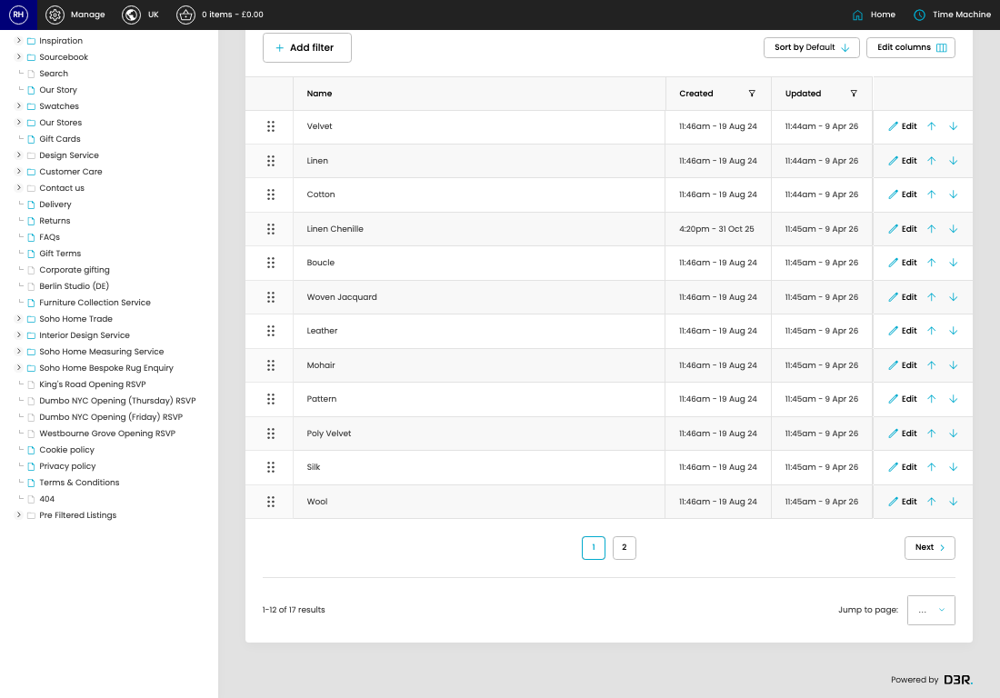

# Swatch Materials

[Home](../../index.md) / Swatch Materials

URL: [https://sohohome.com/cp/swatches-materials-admin](https://sohohome.com/cp/swatches-materials-admin)

Swatch Materials manages the swatch records used for fabric, finish, and material sample journeys.

*Swatch Materials page overview*

## Related Pages

- [Edit Swatch Material](../204-cp-swatches-materials-admin-edit-id-ff372bc0/README.md): Review what already exists, then open a row when a change is needed.

## Using This Page

1. Scan the fields in the table to find the swatch material you need.

## What You Can Do

### Review swatch materials

Review the visible fields to check what already exists.

- Visible fields include Name, Created, and Updated.

Example rows:

| Name | Created | Updated |
| --- | --- | --- |
|  | Velvet | 11:46am - 19 Aug 24 |
|  | Linen | 11:46am - 19 Aug 24 |
|  | Cotton | 11:46am - 19 Aug 24 |

## Page Sections

- Manage Swatches
