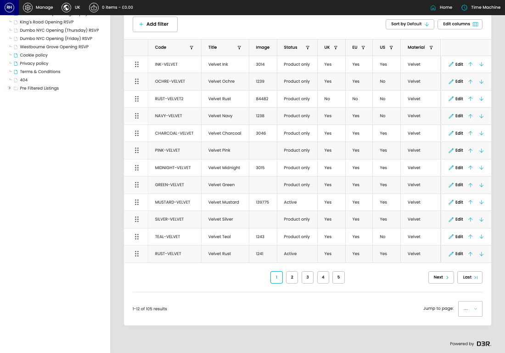

# Swatch Materials

[Home](../../index.md) / Edit Swatch Material

URL: [https://sohohome.com/cp/swatches-materials-admin/edit/8](https://sohohome.com/cp/swatches-materials-admin/edit/8)

Swatch Materials covers the admin screen used to review and maintain swatch materials.

*Swatch Materials page overview*

## Related Pages

- [Swatch Materials](../204-cp-swatches-materials-admin-b455ec72/README.md): Review the visible fields to check what already exists.

## Using This Page

1. Open Swatch Materials from the CP navigation.
2. Scan the fields in the table to find the swatch material you need.
3. Open a row when you need to check the details or make a change.

## What You Can Do

### Review swatch materials

Review what already exists, then open a row when a change is needed.

- Field: Code
- Field: Title
- Field: Image
- Field: Status
- Field: UK
- Field: EU
- Field: US
- Field: Material

Example rows:

| Code | Title | Image | Status | UK | EU |
| --- | --- | --- | --- | --- | --- |
|  | INK-VELVET | Velvet Ink | 3014 | Product only | Yes |
|  | OCHRE-VELVET | Velvet Ochre | 1239 | Product only | Yes |
|  | RUST-VELVET2 | Velvet Rust | 84482 | Product only | No |

### Edit an existing swatch material

Open an existing swatch material when you need to check the setup or make a change.

- Save once the details are correct.

## Key Settings

The sections below highlight the settings people are most likely to change.

### Edit Material

#### Name

*Name setting*

Add the name.

**Validation:** Required.

## Available Actions

- Bulk reorder
