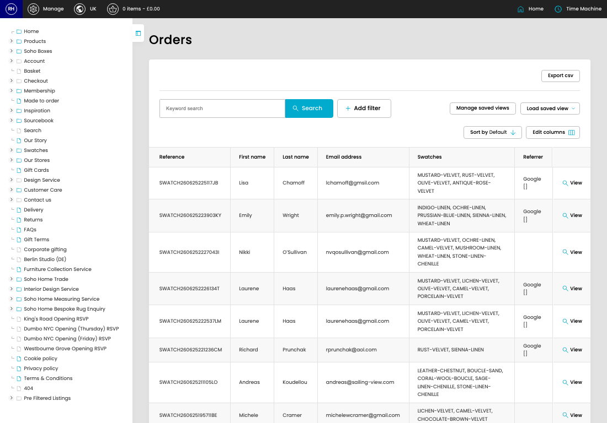

# Swatch Orders

[Home](../../index.md) / Swatch Orders

URL: [https://sohohome.com/cp/swatches-orders](https://sohohome.com/cp/swatches-orders)

Class OrdersControllerAdmin

*Swatch Orders page overview*

## Related Pages

- [View Swatch Order](../207-cp-swatches-orders-view-38784-ce023776/README.md): Open an existing swatch order when you need to check the full details.

## Using This Page

1. Open Swatch Orders from the CP navigation.
2. Search or filter until you find the swatch order you need.

## What You Can Do

### Review swatch orders

Search or filter the visible fields to find the swatch order you need.

- Field: Reference
- Field: First name
- Field: Last name
- Field: Email address
- Field: Swatches
- Field: Referrer

Example rows:

| Reference | First name | Last name | Email address | Swatches | Referrer |
| --- | --- | --- | --- | --- | --- |
| SWATCH260625225117JB | Lisa | Chamoff | lchamoff@gmsil.com | MUSTARD-VELVET, RUST-VELVET, OLIVE-VELVET, ANTIQUE-ROSE-VELVET | Google [] |
| SWATCH260625223903KY | Emily | Wright | emily.p.wright@gmail.com | INDIGO-LINEN, OCHRE-LINEN, PRUSSIAN-BLUE-LINEN, SIENNA-LINEN, WHEAT-LINEN | Google [] |
| SWATCH2606252227043I | Nikki | O’Sullivan | nvqosullivan@gmail.com | MUSTARD-VELVET, OCHRE-LINEN, CAMEL-VELVET, MUSHROOM-LINEN, WHEAT-LINEN, STONE-LINEN-CHENIL |  |

## Key Settings

The sections below highlight the settings people are most likely to change.

### Swatch Orders

#### select

*select setting*

Choose the option that matches this select.

**Options:** Load saved view, Export 3.3

## Available Actions

- Manage saved views
