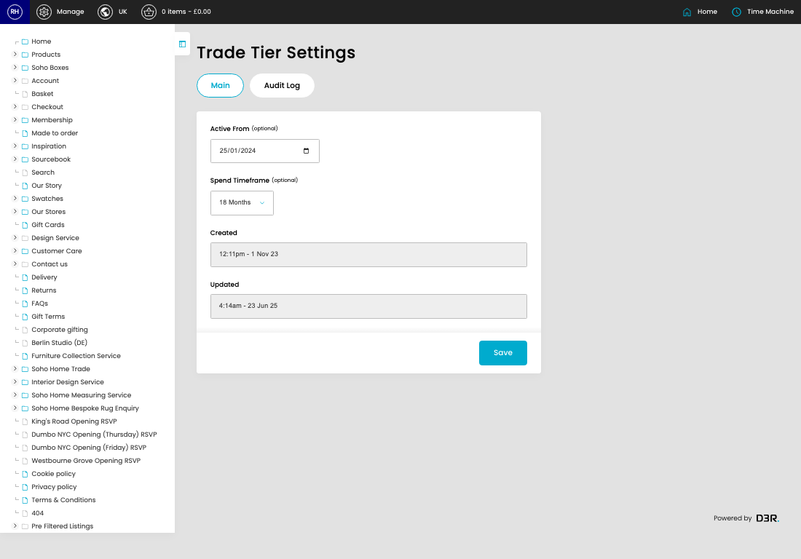
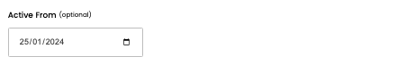
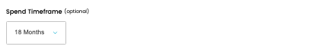

# Trade Tier Settings

[Home](../../index.md) / Trade Tier Settings

URL: [https://sohohome.com/cp/trade-tier-settings-admin](https://sohohome.com/cp/trade-tier-settings-admin)

Manage trade tier settings

*Trade Tier Settings page overview*

## How It Works

- Makes sure the transfer property is set appropriately.
- The key fields are Active From and Spend Timeframe, which explain what the record is for and how it can be used.

## Using This Page

1. Open the Trade Tier Settings screen.
2. Work through the fields that are relevant to the change, then save once the details are correct.

## What You Can Do

### Update settings

Use the fields on this screen to make the change, then save once the values are correct.

## Key Settings

### Trade Tier Settings

#### Active From (optional)

*Active From (optional) setting*

Add the active from (optional).

**Notes:** optional

#### Spend Timeframe (optional)

*Spend Timeframe (optional) setting*

Choose the option that matches this spend timeframe (optional).

**Options:** 18 Months, 12 Months, 11 Months, 6 Months, All Time

**Notes:** optional

## Available Actions

- Main
- Audit Log
