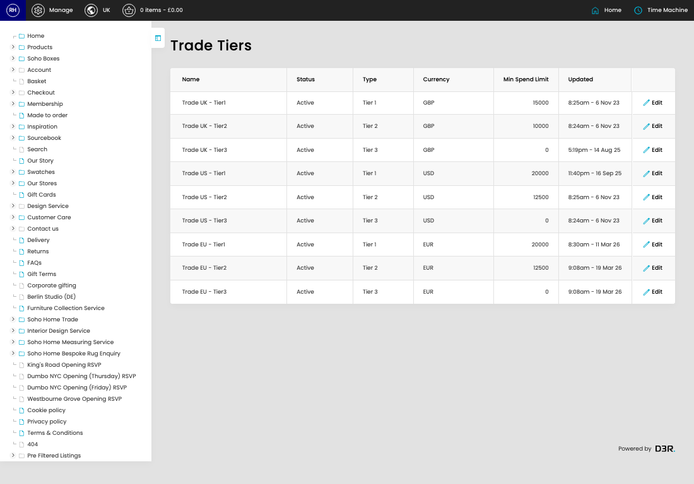

# Trade Tiers

[Home](../../index.md) / Trade Tiers

URL: [https://sohohome.com/cp/trade-tiers-admin](https://sohohome.com/cp/trade-tiers-admin)

Trade Tiers covers the admin screen used to review and maintain trade tiers.

*Trade Tiers page overview*

## Related Pages

- [Edit Trade Tier](../210-cp-trade-tiers-admin-edit-1-9437078d/README.md): Open an existing trade tier when you need to check the setup or make a change.

## How It Works

- Makes sure the transfer property is set appropriately.
- The key fields are Name, Status, Type, Currency, and Min Spend Limit, which explain what the record is for and how it can be used.

## Using This Page

1. Open Trade Tiers from the CP navigation.
2. Scan the fields in the table to find the trade tier you need.

## What You Can Do

### Review trade tiers

Review the visible fields to check what already exists.

- Field: Name
- Field: Status
- Field: Type
- Field: Currency
- Field: Min Spend Limit
- Field: Updated

Example rows:

| Name | Status | Type | Currency | Min Spend Limit | Updated |
| --- | --- | --- | --- | --- | --- |
| Trade UK - Tier1 | Active | Tier 1 | GBP | 15000 | 8:25am - 6 Nov 23 |
| Trade UK - Tier2 | Active | Tier 2 | GBP | 10000 | 8:24am - 6 Nov 23 |
| Trade UK - Tier3 | Active | Tier 3 | GBP | 0 | 5:19pm - 14 Aug 25 |
