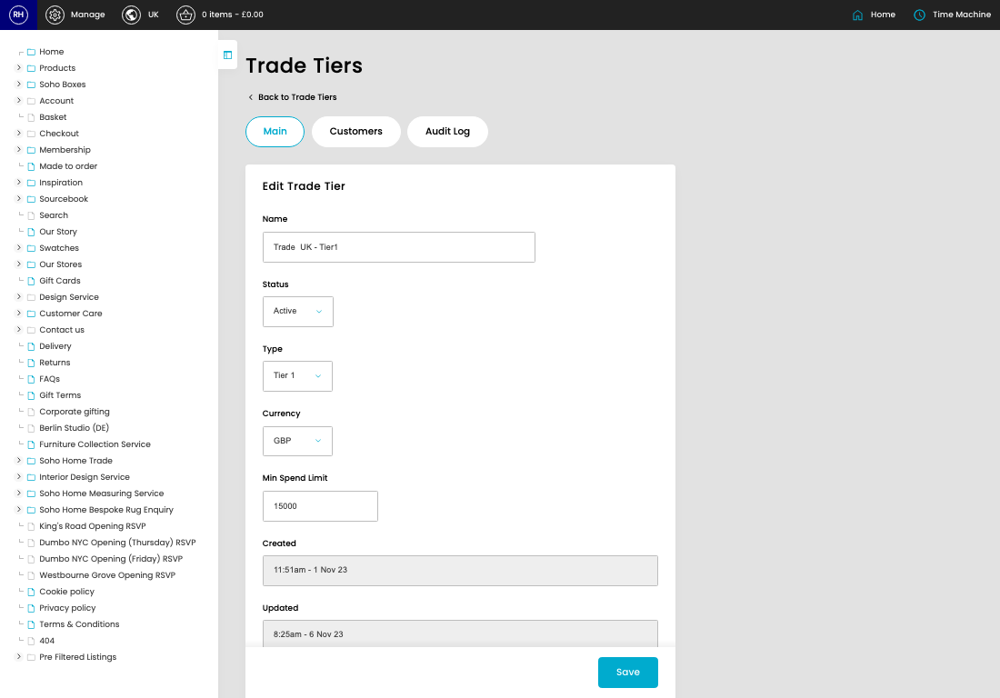
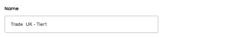
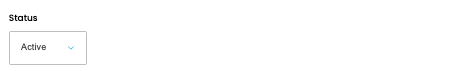
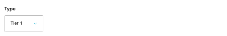
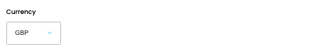
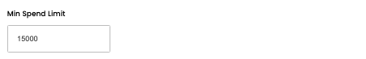

# Trade Tiers

[Home](../../index.md) / Edit Trade Tier

URL: [https://sohohome.com/cp/trade-tiers-admin/edit/1](https://sohohome.com/cp/trade-tiers-admin/edit/1)

Trade Tiers covers the admin screen used to review and maintain trade tiers.

*Trade Tiers page overview*

## Related Pages

- [Trade Tiers](../209-cp-trade-tiers-admin-ca98400b/README.md): Review the visible fields to check what already exists.

## How It Works

- Makes sure the transfer property is set appropriately.
- The key fields are Name, Status, Type, Currency, and Min Spend Limit, which explain what the record is for and how it can be used.

## Using This Page

1. Open the existing trade tier you need to change.
2. Work through the fields that are relevant to the change.
3. Save once the details are correct.

## What You Can Do

### Edit an existing trade tier

Open an existing trade tier when you need to check the setup or make a change.

- Save once the details are correct.

## Key Settings

### Edit Trade Tier

#### Name

*Name setting*

Add the name.

**Validation:** Required.

#### Status

*Status setting*

Choose the option that matches this status.

**Options:** Pending, Inactive, Active

#### Type

*Type setting*

Choose the option that matches this type.

**Options:** Tier 1, Tier 2, Tier 3

#### Currency

*Currency setting*

Choose the option that matches this currency.

**Options:** GBP, USD, EUR

#### Min Spend Limit

*Min Spend Limit setting*

Add the min spend limit.

**Validation:** Required.

## Available Actions

- Main
- Customers
- Audit Log
