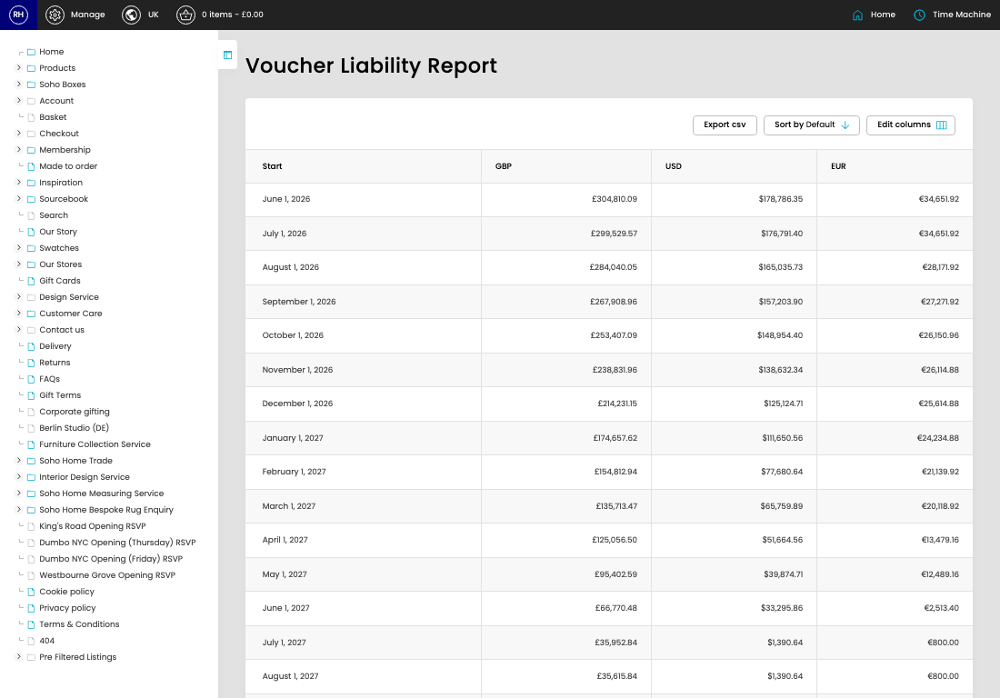

# Voucher Liabilities

[Home](../../index.md) / Voucher Liabilities

URL: [https://sohohome.com/cp/vouchers-liability-admin](https://sohohome.com/cp/vouchers-liability-admin)

Listing controller for the liability report. Read-only

*Voucher Liabilities page overview*

## Using This Page

1. Open Voucher Liabilities from the CP navigation.
2. Scan the fields in the table to find the voucher liability you need.

## What You Can Do

### Review voucher liabilities

Review the visible fields to check what already exists.

- Field: Start
- Field: GBP
- Field: USD
- Field: EUR

Example rows:

| Start | GBP | USD | EUR |
| --- | --- | --- | --- |
| June 1, 2026 | £304,810.09 | $178,786.35 | €34,651.92 |
| July 1, 2026 | £299,529.57 | $176,791.40 | €34,651.92 |
| August 1, 2026 | £284,040.05 | $165,035.73 | €28,171.92 |
