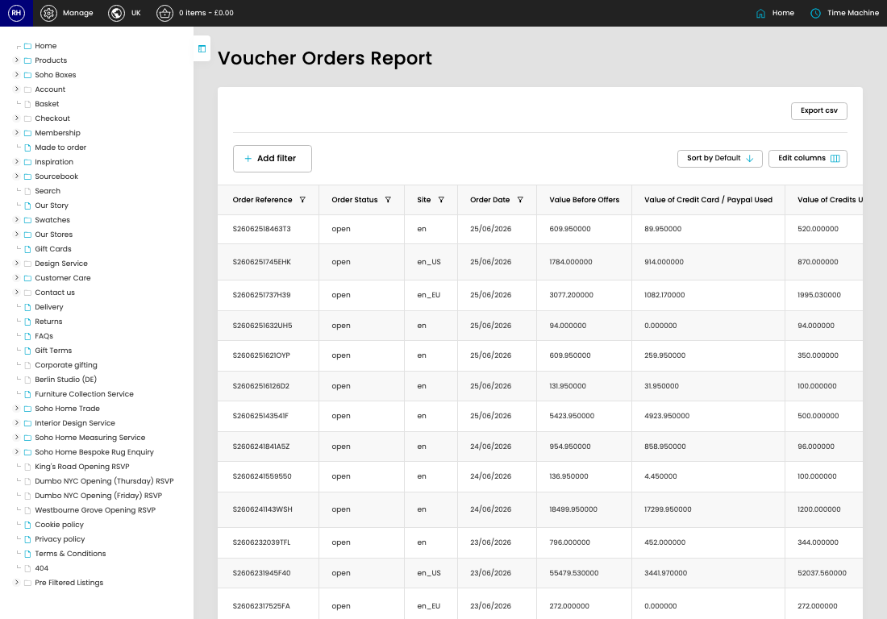

# Voucher Orders

[Home](../../index.md) / Voucher Orders

URL: [https://sohohome.com/cp/vouchers-orders-admin](https://sohohome.com/cp/vouchers-orders-admin)

Listing controller for the voucher orders. Read-only

*Voucher Orders page overview*

## Using This Page

1. Open Voucher Orders from the CP navigation.
2. Scan the fields in the table to find the voucher order you need.

## What You Can Do

### Review voucher orders

Review the visible fields to check what already exists.

- Field: Order Reference
- Field: Order Status
- Field: Site
- Field: Order Date
- Field: Value Before Offers
- Field: Value of Credit Card / Paypal Used
- Field: Value of Credits Used
- Field: Total Shipped Value
- Field: Total Credit Lines
- Field: Customer Name
- Field: Customer Email
- Field: Customer Member ID

Example rows:

| Order Reference | Order Status | Site | Order Date | Value Before Offers | Value of Credit Card / Paypal Used |
| --- | --- | --- | --- | --- | --- |
| S26062518463T3 | open | en | 25/06/2026 | 609.950000 | 89.950000 |
| S2606251745EHK | open | en_US | 25/06/2026 | 1784.000000 | 914.000000 |
| S2606251737H39 | open | en_EU | 25/06/2026 | 3077.200000 | 1082.170000 |
