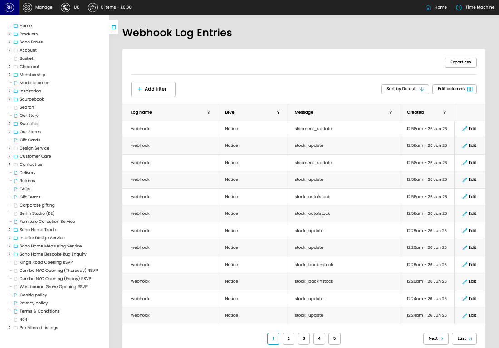

# Webhooks Log

[Home](../../index.md) / Webhooks Log

URL: [https://sohohome.com/cp/webhook-log-admin](https://sohohome.com/cp/webhook-log-admin)

Webhooks Log records incoming AIS webhook activity so failed or processed requests can be reviewed later.

*Webhooks Log page overview*

## Related Pages

- [Edit Webhooks Log](../214-cp-webhook-log-admin-edit-id-497e71c4/README.md): Open an existing webhooks log when you need to check the setup or make a change.

## Using This Page

1. Scan the fields in the table to find the webhooks log you need.

## What You Can Do

### Review webhooks log

Review the visible fields to check what already exists.

- Visible fields include Log Name, Level, Message, and Created.

Example rows:

| Log Name | Level | Message | Created |
| --- | --- | --- | --- |
| webhook | Notice | shipment_update | 12:58am - 26 Jun 26 |
| webhook | Notice | stock_update | 12:58am - 26 Jun 26 |
| webhook | Notice | shipment_update | 12:58am - 26 Jun 26 |
