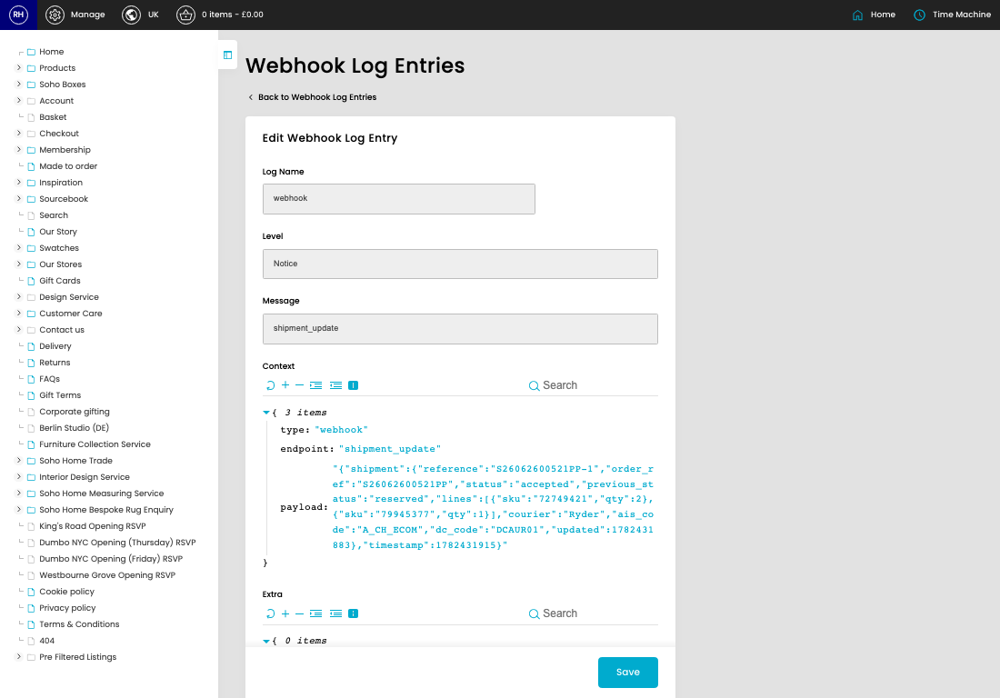

# Webhooks Log

[Home](../../index.md) / Edit Webhooks Log

URL: [https://sohohome.com/cp/webhook-log-admin/edit/2539610](https://sohohome.com/cp/webhook-log-admin/edit/2539610)

Webhooks Log records incoming AIS webhook activity so failed or processed requests can be reviewed later.

*Webhooks Log page overview*

## Related Pages

- [Webhooks Log](../214-cp-webhook-log-admin-e3ec6a69/README.md): Review the visible fields to check what already exists.

## Using This Page

1. Open the existing webhooks log you need to change.
2. Work through the fields that are relevant to the change.
3. Save once the details are correct.

## What You Can Do

### Edit an existing webhooks log

Open an existing webhooks log when you need to check the setup or make a change.

- Save once the details are correct.
