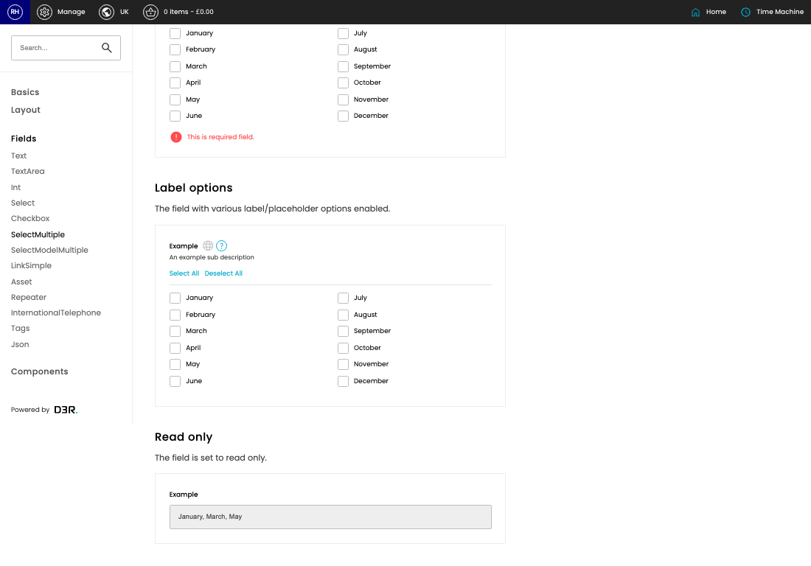

# CP Styleguide

[Home](../../index.md) / CP Styleguide

URL: [https://sohohome.com/cp/styleguide-admin/select-multiple-field](https://sohohome.com/cp/styleguide-admin/select-multiple-field)

CP Styleguide shows the details for this CP styleguide.

*CP Styleguide page overview*

## Related Pages

- [CP Styleguide](../197-cp-styleguide-admin-dba34b54/README.md): CP Styleguide shows the details for this CP styleguide.
- [CP Styleguide](../217-cp-styleguide-admin-colours-ba1d95c1/README.md): CP Styleguide shows the details for this CP styleguide.
- [CP Styleguide](../219-cp-styleguide-admin-icons-a994acf8/README.md): CP Styleguide shows the details for this CP styleguide.
- [CP Styleguide](../220-cp-styleguide-admin-buttons-da6eaafb/README.md): CP Styleguide shows the details for this CP styleguide.
- [CP Styleguide](../221-cp-styleguide-admin-loaders-0ac016ee/README.md): CP Styleguide shows the details for this CP styleguide.
- [CP Styleguide](../223-cp-styleguide-admin-indicators-2a2e3114/README.md): CP Styleguide shows the details for this CP styleguide.
- [CP Styleguide](../224-cp-styleguide-admin-tags-fc1e358c/README.md): CP Styleguide shows the details for this CP styleguide.
- [CP Styleguide](../225-cp-styleguide-admin-column-eee2fd5a/README.md): CP Styleguide shows the details for this CP styleguide.
- [CP Styleguide](../226-cp-styleguide-admin-row-342caeed/README.md): CP Styleguide shows the details for this CP styleguide.
- [CP Styleguide](../228-cp-styleguide-admin-section-8d343c50/README.md): CP Styleguide shows the details for this CP styleguide.
- [CP Styleguide](../229-cp-styleguide-admin-text-field-48351975/README.md): CP Styleguide shows the details for this CP styleguide.
- [CP Styleguide](../230-cp-styleguide-admin-textarea-field-70061e8f/README.md): CP Styleguide shows the details for this CP styleguide.
- [CP Styleguide](../231-cp-styleguide-admin-int-field-825d1a46/README.md): CP Styleguide shows the details for this CP styleguide.
- [CP Styleguide](../232-cp-styleguide-admin-select-field-7417121b/README.md): CP Styleguide shows the details for this CP styleguide.
- [CP Styleguide](../233-cp-styleguide-admin-checkbox-field-a3fe2c1d/README.md): CP Styleguide shows the details for this CP styleguide.
- [CP Styleguide](../235-cp-styleguide-admin-select-model-multiple-field-c5a09e29/README.md): CP Styleguide shows the details for this CP styleguide.
- [CP Styleguide](../236-cp-styleguide-admin-linksimple-field-96dbe949/README.md): CP Styleguide shows the details for this CP styleguide.
- [CP Styleguide](../237-cp-styleguide-admin-asset-field-c845edf3/README.md): CP Styleguide shows the details for this CP styleguide.
- [CP Styleguide](../238-cp-styleguide-admin-repeater-field-688cac90/README.md): CP Styleguide shows the details for this CP styleguide.
- [CP Styleguide](../239-cp-styleguide-admin-intltel-field-209a349d/README.md): CP Styleguide shows the details for this CP styleguide.
- [CP Styleguide](../240-cp-styleguide-admin-tags-field-e3c7ea68/README.md): CP Styleguide shows the details for this CP styleguide.
- [CP Styleguide](../241-cp-styleguide-admin-json-field-00eba047/README.md): CP Styleguide shows the details for this CP styleguide.
- [CP Styleguide](../243-cp-styleguide-admin-highlights-76e47639/README.md): CP Styleguide shows the details for this CP styleguide.
- [CP Styleguide](../244-cp-styleguide-admin-sidebar-f21a94c2/README.md): CP Styleguide shows the details for this CP styleguide.
- [CP Styleguide](../246-cp-styleguide-admin-autocomplete-e0ca7ab5/README.md): CP Styleguide shows the details for this CP styleguide.
- [CP Styleguide](../247-cp-styleguide-admin-overlays-ce2a7f2b/README.md): CP Styleguide shows the details for this CP styleguide.
- [CP Styleguide](../248-cp-styleguide-admin-dialogs-5ae1dd5a/README.md): CP Styleguide shows the details for this CP styleguide.
- [CP Styleguide](../249-cp-styleguide-admin-date-picker-62623216/README.md): CP Styleguide shows the details for this CP styleguide.
- [CP Styleguide](../250-cp-styleguide-admin-quantity-selector-44cf9e02/README.md): CP Styleguide shows the details for this CP styleguide.
- [CP Styleguide](../251-cp-styleguide-admin-actions-popover-4acbfe7a/README.md): CP Styleguide shows the details for this CP styleguide.
- [CP Styleguide Grid](../227-cp-styleguide-admin-grid-b21092e1/README.md): Search or filter the visible fields to find the CP styleguide you need.
- [CP Styleguide Popover](../245-cp-styleguide-admin-popover-14911747/README.md): Search or filter the visible fields to find the CP styleguide you need.
- [CP Styleguide Tables](../242-cp-styleguide-admin-tables-21cd479e/README.md): Search or filter the visible fields to find the CP styleguide you need.
- [CP Styleguide Typography](../218-cp-styleguide-admin-typography-832e16ca/README.md): Search or filter the visible fields to find the CP styleguide you need.
- [CP Styleguide Z Index](../222-cp-styleguide-admin-z-index-4860a309/README.md): Search or filter the visible fields to find the CP styleguide you need.

## Using This Page

1. Open the CP Styleguide screen.
2. Use the visible fields to check the details.

## Key Settings

The sections below highlight the settings people are most likely to change.

### CP Styleguide

#### January

*January setting*

Turn this on when january should apply. Leave it off when it should not.

#### February

*February setting*

Turn this on when february should apply. Leave it off when it should not.

#### March

*March setting*

Turn this on when march should apply. Leave it off when it should not.

#### April

*April setting*

Turn this on when april should apply. Leave it off when it should not.

#### May

*May setting*

Turn this on when may should apply. Leave it off when it should not.

#### June

*June setting*

Turn this on when june should apply. Leave it off when it should not.

#### July

*July setting*

Turn this on when july should apply. Leave it off when it should not.

#### August

*August setting*

Turn this on when august should apply. Leave it off when it should not.

#### September

Turn this on when september should apply. Leave it off when it should not.

#### October

Turn this on when october should apply. Leave it off when it should not.

#### November

Turn this on when november should apply. Leave it off when it should not.

#### December

Turn this on when december should apply. Leave it off when it should not.

#### January

Turn this on when january should apply. Leave it off when it should not.

#### February

Turn this on when february should apply. Leave it off when it should not.

#### March

Turn this on when march should apply. Leave it off when it should not.

#### April

Turn this on when april should apply. Leave it off when it should not.

#### May

Turn this on when may should apply. Leave it off when it should not.

#### June

Turn this on when june should apply. Leave it off when it should not.

#### July

Turn this on when july should apply. Leave it off when it should not.

#### August

Turn this on when august should apply. Leave it off when it should not.

#### September

Turn this on when september should apply. Leave it off when it should not.

#### October

Turn this on when october should apply. Leave it off when it should not.

#### November

Turn this on when november should apply. Leave it off when it should not.

#### December

Turn this on when december should apply. Leave it off when it should not.
