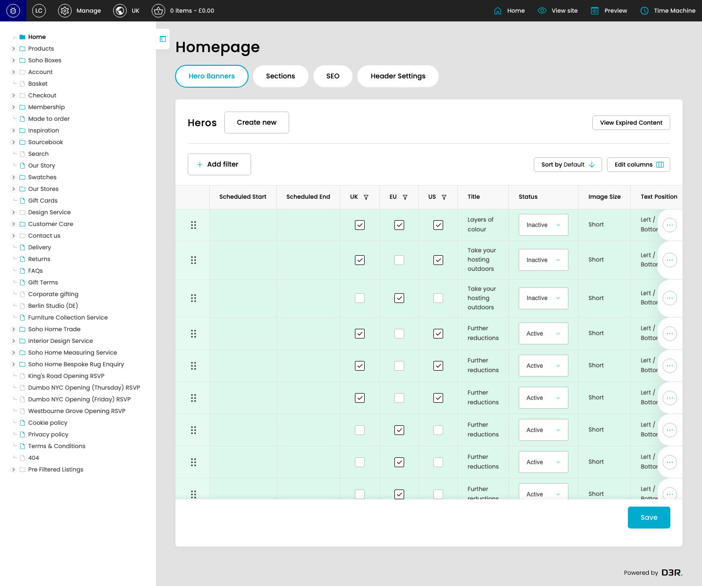

# Favourites

Captured documentation draft for Favourites.

*Favourites page overview*

## Page Details

- URL: https://dev.soho-home.local/cp
- Generated: 2026-06-27T20:54:52.638Z

## Using This Page

1. Open the Favourites page from the relevant navigation area or direct URL.
2. Review the visible sections to understand which part of the feature each setting controls.
3. Update the relevant settings, then use the page actions shown below to save or continue.

## Key Settings

This page exposes 39 detected controls. The sections below focus on the settings most likely to define the feature behaviour; the full field inventory is kept at the end for reference.

### listing-home_heros-hero-form

#### Hero UK

*Hero UK setting*

Set the Hero UK value for each relevant row in this section.

**Effect:** Submitted as inline[4][hero_uk]. Read the referenced controller/model code to confirm downstream behaviour.

**Validation:** No required marker detected.

**Submitted as:** `inline[4][hero_uk]`

#### Hero EU

*Hero EU setting*

Set the Hero EU value for each relevant row in this section.

**Effect:** Submitted as inline[4][hero_eu]. Read the referenced controller/model code to confirm downstream behaviour.

**Validation:** No required marker detected.

**Submitted as:** `inline[4][hero_eu]`

#### Hero US

*Hero US setting*

Set the Hero US value for each relevant row in this section.

**Effect:** Submitted as inline[4][hero_us]. Read the referenced controller/model code to confirm downstream behaviour.

**Validation:** No required marker detected.

**Submitted as:** `inline[4][hero_us]`

#### Hero Status

*Hero Status setting*

Set the Hero Status value for each relevant row in this section.

**Effect:** Submitted as inline[4][hero_status]. Read the referenced controller/model code to confirm downstream behaviour.

**Validation:** No required marker detected.

**Options:** select…, Active, Inactive

**Submitted as:** `inline[4][hero_status]`

## Actions And Behaviour

- Jump
- Hero Banners
- Sections
- SEO
- Header Settings
- Create new
- View Expired Content
- Add filter
- Sort by Default
- Edit columns
- Save

## Technical References

- Controller: not resolved from provider aliases.

## Field Reference

| Field | Type | Stores as | Notes |
| --- | --- | --- | --- |
| Search | text |  |  |
| Jump to | datetime-local | `date` |  |
| Hero UK | checkbox | `inline[4][hero_uk]` |  |
| Hero EU | checkbox | `inline[4][hero_eu]` |  |
| Hero US | checkbox | `inline[4][hero_us]` |  |
| Hero Status | select | `inline[4][hero_status]` |  |
| Hero UK | checkbox | `inline[5][hero_uk]` |  |
| Hero EU | checkbox | `inline[5][hero_eu]` |  |
| Hero US | checkbox | `inline[5][hero_us]` |  |
| Hero Status | select | `inline[5][hero_status]` |  |
| Hero UK | checkbox | `inline[186][hero_uk]` |  |
| Hero EU | checkbox | `inline[186][hero_eu]` |  |
| Hero US | checkbox | `inline[186][hero_us]` |  |
| Hero Status | select | `inline[186][hero_status]` |  |
| Hero UK | checkbox | `inline[1][hero_uk]` |  |
| Hero EU | checkbox | `inline[1][hero_eu]` |  |
| Hero US | checkbox | `inline[1][hero_us]` |  |
| Hero Status | select | `inline[1][hero_status]` |  |
| Hero UK | checkbox | `inline[8][hero_uk]` |  |
| Hero EU | checkbox | `inline[8][hero_eu]` |  |
| Hero US | checkbox | `inline[8][hero_us]` |  |
| Hero Status | select | `inline[8][hero_status]` |  |
| Hero UK | checkbox | `inline[7][hero_uk]` |  |
| Hero EU | checkbox | `inline[7][hero_eu]` |  |
| Hero US | checkbox | `inline[7][hero_us]` |  |
| Hero Status | select | `inline[7][hero_status]` |  |
| Hero UK | checkbox | `inline[2][hero_uk]` |  |
| Hero EU | checkbox | `inline[2][hero_eu]` |  |
| Hero US | checkbox | `inline[2][hero_us]` |  |
| Hero Status | select | `inline[2][hero_status]` |  |
| Hero UK | checkbox | `inline[6][hero_uk]` |  |
| Hero EU | checkbox | `inline[6][hero_eu]` |  |
| Hero US | checkbox | `inline[6][hero_us]` |  |
| Hero Status | select | `inline[6][hero_status]` |  |
| Hero UK | checkbox | `inline[161][hero_uk]` |  |
| Hero EU | checkbox | `inline[161][hero_eu]` |  |
| Hero US | checkbox | `inline[161][hero_us]` |  |
| Hero Status | select | `inline[161][hero_status]` |  |
| hero_inline_action | submit | `hero_inline_action` |  |
