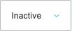
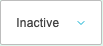
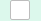
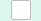
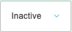
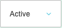
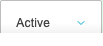

# Favourites

- URL: https://dev.soho-home.local/cp
- Generated: 2026-06-27T20:31:45.098Z

## Purpose

Captured documentation draft for Favourites.

## Code Context

- Controller: not resolved from provider aliases.

## How To Use

1. Review the visible form sections.
2. Complete the fields listed below.
3. Use the page actions shown in the Actions section to save or continue.

## Actions

- Jump
- Hero Banners
- Sections
- SEO
- Header Settings
- Create new
- View Expired Content
- Add filter
- Sort by Default
- Edit columns
- Save

## Fields

### 1. Search

- Type: `text`

**How to use:** Enter a value matching "Search".

**Effect:** Read the referenced controller/model code to confirm downstream behaviour.

**Validation:** No required marker detected.

### 2. Jump to

- Type: `datetime-local`
- Name: `date`

**How to use:** Complete this field according to the page context.

**Effect:** Submitted as date. Read the referenced controller/model code to confirm downstream behaviour.

**Validation:** No required marker detected.

### 3. inline[4][hero_uk]

- Type: `checkbox`
- Name: `inline[4][hero_uk]`

**How to use:** Complete this field according to the page context.

**Effect:** Submitted as inline[4][hero_uk]. Read the referenced controller/model code to confirm downstream behaviour.

**Validation:** No required marker detected.

### 4. inline[4][hero_eu]

- Type: `checkbox`
- Name: `inline[4][hero_eu]`

**How to use:** Complete this field according to the page context.

**Effect:** Submitted as inline[4][hero_eu]. Read the referenced controller/model code to confirm downstream behaviour.

**Validation:** No required marker detected.

### 5. inline[4][hero_us]

- Type: `checkbox`
- Name: `inline[4][hero_us]`

**How to use:** Complete this field according to the page context.

**Effect:** Submitted as inline[4][hero_us]. Read the referenced controller/model code to confirm downstream behaviour.

**Validation:** No required marker detected.

### 6. inline[4][hero_status]

- Type: `select`
- Name: `inline[4][hero_status]`
- Options: select…, Active, Inactive

**How to use:** Complete this field according to the page context.

**Effect:** Submitted as inline[4][hero_status]. Read the referenced controller/model code to confirm downstream behaviour.

**Validation:** No required marker detected.

### 7. inline[5][hero_uk]

- Type: `checkbox`
- Name: `inline[5][hero_uk]`

**How to use:** Complete this field according to the page context.

**Effect:** Submitted as inline[5][hero_uk]. Read the referenced controller/model code to confirm downstream behaviour.

**Validation:** No required marker detected.

### 8. inline[5][hero_eu]

- Type: `checkbox`
- Name: `inline[5][hero_eu]`

**How to use:** Complete this field according to the page context.

**Effect:** Submitted as inline[5][hero_eu]. Read the referenced controller/model code to confirm downstream behaviour.

**Validation:** No required marker detected.

### 9. inline[5][hero_us]

- Type: `checkbox`
- Name: `inline[5][hero_us]`

**How to use:** Complete this field according to the page context.

**Effect:** Submitted as inline[5][hero_us]. Read the referenced controller/model code to confirm downstream behaviour.

**Validation:** No required marker detected.

### 10. inline[5][hero_status]

- Type: `select`
- Name: `inline[5][hero_status]`
- Options: select…, Active, Inactive

**How to use:** Complete this field according to the page context.

**Effect:** Submitted as inline[5][hero_status]. Read the referenced controller/model code to confirm downstream behaviour.

**Validation:** No required marker detected.

### 11. inline[186][hero_uk]

- Type: `checkbox`
- Name: `inline[186][hero_uk]`

**How to use:** Complete this field according to the page context.

**Effect:** Submitted as inline[186][hero_uk]. Read the referenced controller/model code to confirm downstream behaviour.

**Validation:** No required marker detected.

### 12. inline[186][hero_eu]

- Type: `checkbox`
- Name: `inline[186][hero_eu]`

**How to use:** Complete this field according to the page context.

**Effect:** Submitted as inline[186][hero_eu]. Read the referenced controller/model code to confirm downstream behaviour.

**Validation:** No required marker detected.

### 13. inline[186][hero_us]

- Type: `checkbox`
- Name: `inline[186][hero_us]`

**How to use:** Complete this field according to the page context.

**Effect:** Submitted as inline[186][hero_us]. Read the referenced controller/model code to confirm downstream behaviour.

**Validation:** No required marker detected.

### 14. inline[186][hero_status]

- Type: `select`
- Name: `inline[186][hero_status]`
- Options: select…, Active, Inactive

**How to use:** Complete this field according to the page context.

**Effect:** Submitted as inline[186][hero_status]. Read the referenced controller/model code to confirm downstream behaviour.

**Validation:** No required marker detected.

### 15. inline[1][hero_uk]

- Type: `checkbox`
- Name: `inline[1][hero_uk]`

**How to use:** Complete this field according to the page context.

**Effect:** Submitted as inline[1][hero_uk]. Read the referenced controller/model code to confirm downstream behaviour.

**Validation:** No required marker detected.

### 16. inline[1][hero_eu]

- Type: `checkbox`
- Name: `inline[1][hero_eu]`

**How to use:** Complete this field according to the page context.

**Effect:** Submitted as inline[1][hero_eu]. Read the referenced controller/model code to confirm downstream behaviour.

**Validation:** No required marker detected.

### 17. inline[1][hero_us]

- Type: `checkbox`
- Name: `inline[1][hero_us]`

**How to use:** Complete this field according to the page context.

**Effect:** Submitted as inline[1][hero_us]. Read the referenced controller/model code to confirm downstream behaviour.

**Validation:** No required marker detected.

### 18. inline[1][hero_status]

- Type: `select`
- Name: `inline[1][hero_status]`
- Options: select…, Active, Inactive

**How to use:** Complete this field according to the page context.

**Effect:** Submitted as inline[1][hero_status]. Read the referenced controller/model code to confirm downstream behaviour.

**Validation:** No required marker detected.

### 19. inline[8][hero_uk]

- Type: `checkbox`
- Name: `inline[8][hero_uk]`

**How to use:** Complete this field according to the page context.

**Effect:** Submitted as inline[8][hero_uk]. Read the referenced controller/model code to confirm downstream behaviour.

**Validation:** No required marker detected.

### 20. inline[8][hero_eu]

- Type: `checkbox`
- Name: `inline[8][hero_eu]`

**How to use:** Complete this field according to the page context.

**Effect:** Submitted as inline[8][hero_eu]. Read the referenced controller/model code to confirm downstream behaviour.

**Validation:** No required marker detected.

### 21. inline[8][hero_us]

- Type: `checkbox`
- Name: `inline[8][hero_us]`

**How to use:** Complete this field according to the page context.

**Effect:** Submitted as inline[8][hero_us]. Read the referenced controller/model code to confirm downstream behaviour.

**Validation:** No required marker detected.

### 22. inline[8][hero_status]

- Type: `select`
- Name: `inline[8][hero_status]`
- Options: select…, Active, Inactive

**How to use:** Complete this field according to the page context.

**Effect:** Submitted as inline[8][hero_status]. Read the referenced controller/model code to confirm downstream behaviour.

**Validation:** No required marker detected.

### 23. inline[7][hero_uk]

- Type: `checkbox`
- Name: `inline[7][hero_uk]`

**How to use:** Complete this field according to the page context.

**Effect:** Submitted as inline[7][hero_uk]. Read the referenced controller/model code to confirm downstream behaviour.

**Validation:** No required marker detected.

### 24. inline[7][hero_eu]

- Type: `checkbox`
- Name: `inline[7][hero_eu]`

**How to use:** Complete this field according to the page context.

**Effect:** Submitted as inline[7][hero_eu]. Read the referenced controller/model code to confirm downstream behaviour.

**Validation:** No required marker detected.

### 25. inline[7][hero_us]

- Type: `checkbox`
- Name: `inline[7][hero_us]`

**How to use:** Complete this field according to the page context.

**Effect:** Submitted as inline[7][hero_us]. Read the referenced controller/model code to confirm downstream behaviour.

**Validation:** No required marker detected.

### 26. inline[7][hero_status]

- Type: `select`
- Name: `inline[7][hero_status]`
- Options: select…, Active, Inactive

**How to use:** Complete this field according to the page context.

**Effect:** Submitted as inline[7][hero_status]. Read the referenced controller/model code to confirm downstream behaviour.

**Validation:** No required marker detected.

### 27. inline[2][hero_uk]

- Type: `checkbox`
- Name: `inline[2][hero_uk]`

**How to use:** Complete this field according to the page context.

**Effect:** Submitted as inline[2][hero_uk]. Read the referenced controller/model code to confirm downstream behaviour.

**Validation:** No required marker detected.

### 28. inline[2][hero_eu]

- Type: `checkbox`
- Name: `inline[2][hero_eu]`

**How to use:** Complete this field according to the page context.

**Effect:** Submitted as inline[2][hero_eu]. Read the referenced controller/model code to confirm downstream behaviour.

**Validation:** No required marker detected.

### 29. inline[2][hero_us]

- Type: `checkbox`
- Name: `inline[2][hero_us]`

**How to use:** Complete this field according to the page context.

**Effect:** Submitted as inline[2][hero_us]. Read the referenced controller/model code to confirm downstream behaviour.

**Validation:** No required marker detected.

### 30. inline[2][hero_status]

- Type: `select`
- Name: `inline[2][hero_status]`
- Options: select…, Active, Inactive

**How to use:** Complete this field according to the page context.

**Effect:** Submitted as inline[2][hero_status]. Read the referenced controller/model code to confirm downstream behaviour.

**Validation:** No required marker detected.

### 31. inline[6][hero_uk]

- Type: `checkbox`
- Name: `inline[6][hero_uk]`

**How to use:** Complete this field according to the page context.

**Effect:** Submitted as inline[6][hero_uk]. Read the referenced controller/model code to confirm downstream behaviour.

**Validation:** No required marker detected.

### 32. inline[6][hero_eu]

- Type: `checkbox`
- Name: `inline[6][hero_eu]`

**How to use:** Complete this field according to the page context.

**Effect:** Submitted as inline[6][hero_eu]. Read the referenced controller/model code to confirm downstream behaviour.

**Validation:** No required marker detected.

### 33. inline[6][hero_us]

- Type: `checkbox`
- Name: `inline[6][hero_us]`

**How to use:** Complete this field according to the page context.

**Effect:** Submitted as inline[6][hero_us]. Read the referenced controller/model code to confirm downstream behaviour.

**Validation:** No required marker detected.

### 34. inline[6][hero_status]

- Type: `select`
- Name: `inline[6][hero_status]`
- Options: select…, Active, Inactive

**How to use:** Complete this field according to the page context.

**Effect:** Submitted as inline[6][hero_status]. Read the referenced controller/model code to confirm downstream behaviour.

**Validation:** No required marker detected.

### 35. inline[161][hero_uk]

- Type: `checkbox`
- Name: `inline[161][hero_uk]`

**How to use:** Complete this field according to the page context.

**Effect:** Submitted as inline[161][hero_uk]. Read the referenced controller/model code to confirm downstream behaviour.

**Validation:** No required marker detected.

### 36. inline[161][hero_eu]

- Type: `checkbox`
- Name: `inline[161][hero_eu]`

**How to use:** Complete this field according to the page context.

**Effect:** Submitted as inline[161][hero_eu]. Read the referenced controller/model code to confirm downstream behaviour.

**Validation:** No required marker detected.

### 37. inline[161][hero_us]

- Type: `checkbox`
- Name: `inline[161][hero_us]`

**How to use:** Complete this field according to the page context.

**Effect:** Submitted as inline[161][hero_us]. Read the referenced controller/model code to confirm downstream behaviour.

**Validation:** No required marker detected.

### 38. inline[161][hero_status]

- Type: `select`
- Name: `inline[161][hero_status]`
- Options: select…, Active, Inactive

**How to use:** Complete this field according to the page context.

**Effect:** Submitted as inline[161][hero_status]. Read the referenced controller/model code to confirm downstream behaviour.

**Validation:** No required marker detected.

### 39. hero_inline_action

- Type: `submit`
- Name: `hero_inline_action`

**How to use:** Complete this field according to the page context.

**Effect:** Submitted as hero_inline_action. Read the referenced controller/model code to confirm downstream behaviour.

**Validation:** No required marker detected.

## Page Screenshots

### desktop

## Unanswered Questions

- Codex should read the referenced controller, model, XML, and view files before treating this draft as final operator documentation.
