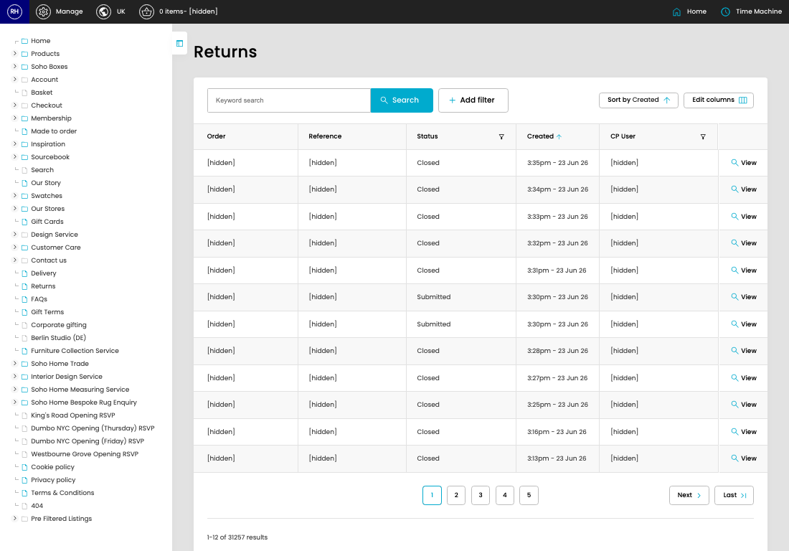

# Returns

[Home](../../index.md) / Returns

URL: [https://sohohome.com/cp/returns-admin](https://sohohome.com/cp/returns-admin)

Returns is used to review return records and follow their processing status.

*Returns page overview*

## How It Works

- Makes sure the transfer property is set appropriately.
- The key fields are Return Queue and CP User, which explain what the record is for and how it can be used.

## Using This Page

1. Search or filter until you find the return you need.

## What You Can Do

### Review returns

Search or filter the visible fields to find the return you need.

- Visible fields include Order, Reference, Status, Created, and CP User.
