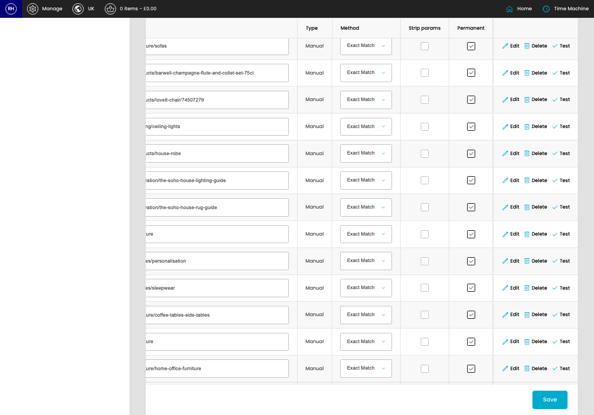

# Redirects

[Home](../../index.md) / Redirects

URL: [https://sohohome.com/cp/redirects](https://sohohome.com/cp/redirects)

Redirects manages URL redirects so old or changed links send visitors to the correct page.

*Redirects page overview*

## Using This Page

1. Search or filter until you find the redirect you need.

## What You Can Do

### Review redirects

Search or filter the visible fields to find the redirect you need.

- Visible fields include From, To, Type, Method, Strip params, and Permanent.

Example rows:

| From | To | Type | Method | Strip params | Permanent |
| --- | --- | --- | --- | --- | --- |
|  |  | Manual | select… Exact Match Head Match |  |  |
|  |  | Manual | select… Exact Match Head Match |  |  |
|  |  | Manual | select… Exact Match Head Match |  |  |

### Update settings

Use the fields on this screen to make the change, then save once the values are correct.
