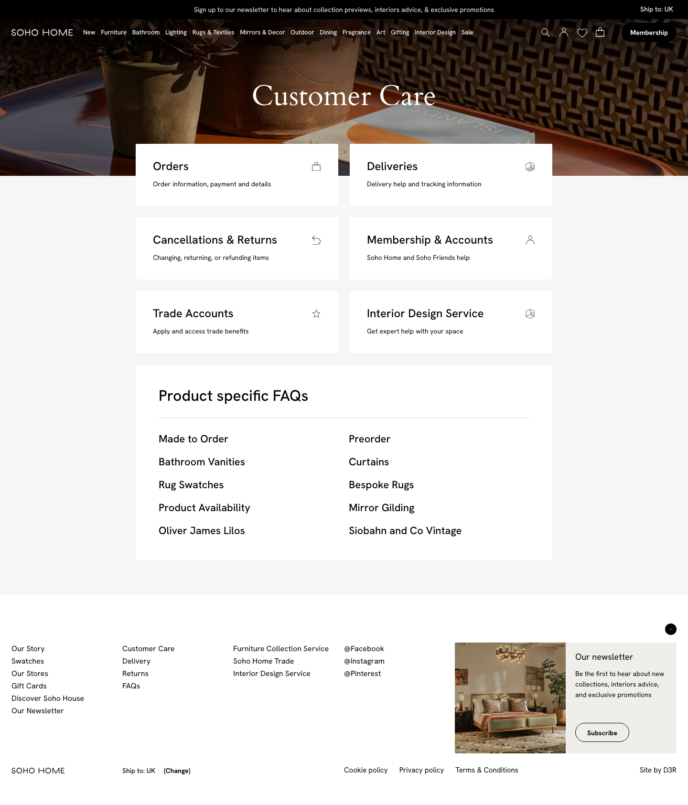

# Customer Care

- URL: https://dev.soho-home.local/customer-care
- Generated: 2026-06-27T20:30:45.395Z

## Purpose

Captured documentation draft for Customer Care. The likely controller is App\CustomerCare\Controller.

## Code Context

- Controller alias: `customer-care`
- Controller class: `App\CustomerCare\Controller`
- Controller file: `src/CustomerCare/Controller.php`
- Action: `indexAction`

## How To Use

1. Review the page content and use the available navigation or actions.

## Actions

- New
- Furniture
- Bathroom
- Lighting
- Rugs & Textiles
- Mirrors & Decor
- Outdoor
- Dining
- Fragrance
- Art
- Gifting
- Interior Design
- Sale
- Toggle Search
- Membership
- Subscribe

## Side Effects

- Review src/CustomerCare/Controller.php for save, edit, index, and custom action behaviour.

## Page Screenshots

### desktop

## Unanswered Questions

- Codex should read the referenced controller, model, XML, and view files before treating this draft as final operator documentation.
