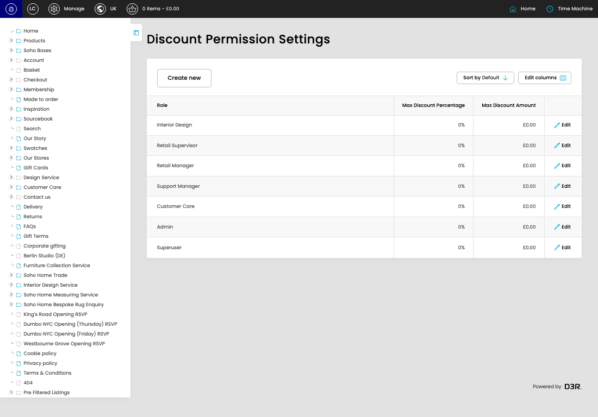

# Discount Permission Settings

Discount Permission Settings control how much discount each admin role can apply when raising custom discounts. Each setting links a role to a percentage limit and, when needed, a fixed amount limit.

*Discount Permission Settings overview*

## What This Feature Does

- Lists the custom discount limits already configured for admin roles.
- Lets an authorised user create a new limit for a role.
- Lets an authorised user edit an existing role limit.
- Caps percentage discounts between 0 and 100.
- Can also cap fixed-amount discounts; a fixed amount of 0 means there is no fixed-amount cap.
- If a user has more than one matching role, the role setting with the highest percentage limit is used.

## Key Settings

- **Role:** Selects which admin role the discount limits apply to.
- **Max Discount Percentage:** Sets the highest percentage discount the role can apply. Use 100 to allow the role to apply any percentage discount.
- **Max Discount Amount (optional):** Sets the highest fixed amount discount the role can apply. Use 0 when the role should not have a fixed-amount cap.

## Screens Covered

1. [Discount Permission Settings listing](pages/001-cp-discount-permission-settings-admin-71eed775/README.md) - Review the roles that already have custom discount limits.
   URL: [https://sohohome.com/cp/discount-permission-settings-admin](https://sohohome.com/cp/discount-permission-settings-admin)
2. [Create Discount Permission Setting](pages/002-cp-discount-permission-settings-admin-edit-new-1ad35cc5/README.md) - Add the role and discount limits for a new permission setting.
   URL: [https://sohohome.com/cp/discount-permission-settings-admin/edit/new](https://sohohome.com/cp/discount-permission-settings-admin/edit/new)
3. [Edit Discount Permission Setting](pages/003-cp-discount-permission-settings-admin-edit-1-4014e007/README.md) - Update the percentage or fixed amount limit for an existing role.
   URL: [https://sohohome.com/cp/discount-permission-settings-admin/edit/1](https://sohohome.com/cp/discount-permission-settings-admin/edit/1)
