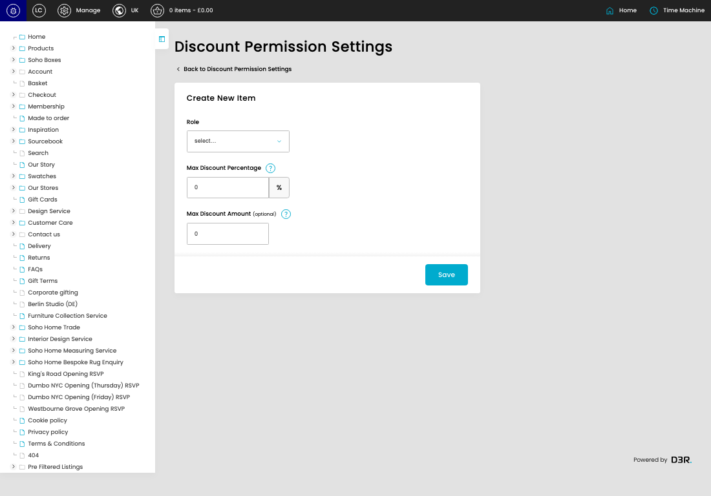
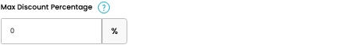
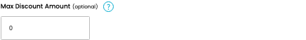

# Discount Permission Settings

URL: [https://sohohome.com/cp/discount-permission-settings-admin/edit/new](https://sohohome.com/cp/discount-permission-settings-admin/edit/new)

Use this form to add a discount limit for an admin role.

*Discount Permission Settings page overview*

## Using This Page

1. Choose the admin role the discount limit applies to.
2. Enter the maximum percentage discount and optional fixed amount cap.
3. Select Save to create the role limit.

## What You Can Do

### Create a role limit

Complete the form to create a discount limit for an admin role.

- Save creates the role limit.

### Set the discount limit

Choose the role, enter the maximum percentage discount, and add a fixed amount cap if needed.

- Use 100 for an unlimited percentage allowance.
- Use 0 in Max Discount Amount for no fixed-amount cap.

## Key Settings

The sections below highlight the settings people are most likely to change.

### Create New Item

#### Role

*Role setting*

Choose the admin role this discount limit applies to.

**Effect:** Sets which admin role the discount limit applies to.

**Options:** Superuser, Admin, Product Master, Customer Care, Marketing, Content, Interior Design, Retail - Amsterdam, Retail - Austin, Retail - Bicester, Retail - Berlin, Retail - Carnaby, and 17 more

#### Max Discount Percentage

*Max Discount Percentage setting*

Enter the highest percentage discount this role can apply.

**Effect:** Sets the highest percentage discount this role can apply.

**Notes:** Enter a value from 0 to 100. Use 100 when the role should be able to apply any percentage discount.

#### Max Discount Amount (optional)

*Max Discount Amount (optional) setting*

Enter the highest fixed discount amount this role can apply, or use 0 for no fixed-amount cap.

**Effect:** Sets the highest fixed discount amount this role can apply.

**Notes:** Set this to 0 when the role should not have a fixed-amount cap.

## Available Actions

- Save
