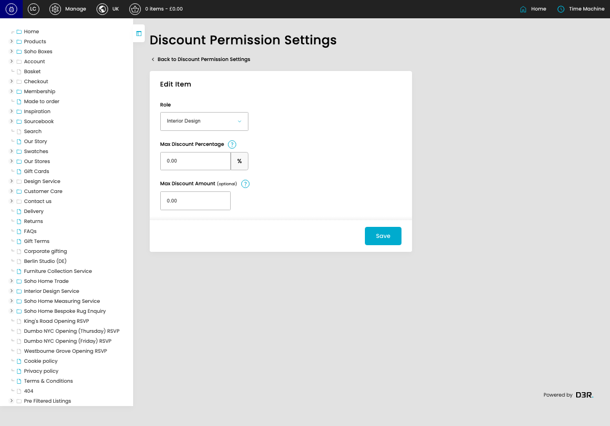
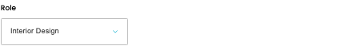
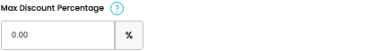
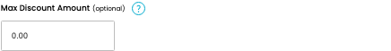

# Discount Permission Settings

URL: [https://sohohome.com/cp/discount-permission-settings-admin/edit/1](https://sohohome.com/cp/discount-permission-settings-admin/edit/1)

Use this form to update the discount limits assigned to an admin role.

*Discount Permission Settings page overview*

## Using This Page

1. Review the selected role and current discount limits.
2. Update the maximum percentage discount or fixed amount cap where needed.
3. Select Save to apply the updated limit.

## What You Can Do

### Edit a role limit

Open an existing role limit to change the percentage cap or fixed amount cap.

- Save applies the updated limits.

## Key Settings

The sections below highlight the settings people are most likely to change.

### Edit Item

#### Role

*Role setting*

Choose the admin role this discount limit applies to.

**Effect:** Sets which admin role the discount limit applies to.

**Options:** Superuser, Admin, Product Master, Customer Care, Marketing, Content, Interior Design, Retail - Amsterdam, Retail - Austin, Retail - Bicester, Retail - Berlin, Retail - Carnaby, and 17 more

#### Max Discount Percentage

*Max Discount Percentage setting*

Enter the highest percentage discount this role can apply.

**Effect:** Sets the highest percentage discount this role can apply.

**Notes:** Enter a value from 0 to 100. Use 100 when the role should be able to apply any percentage discount.

#### Max Discount Amount (optional)

*Max Discount Amount (optional) setting*

Enter the highest fixed discount amount this role can apply, or use 0 for no fixed-amount cap.

**Effect:** Sets the highest fixed discount amount this role can apply.

**Notes:** Set this to 0 when the role should not have a fixed-amount cap.

## Available Actions

- Save
