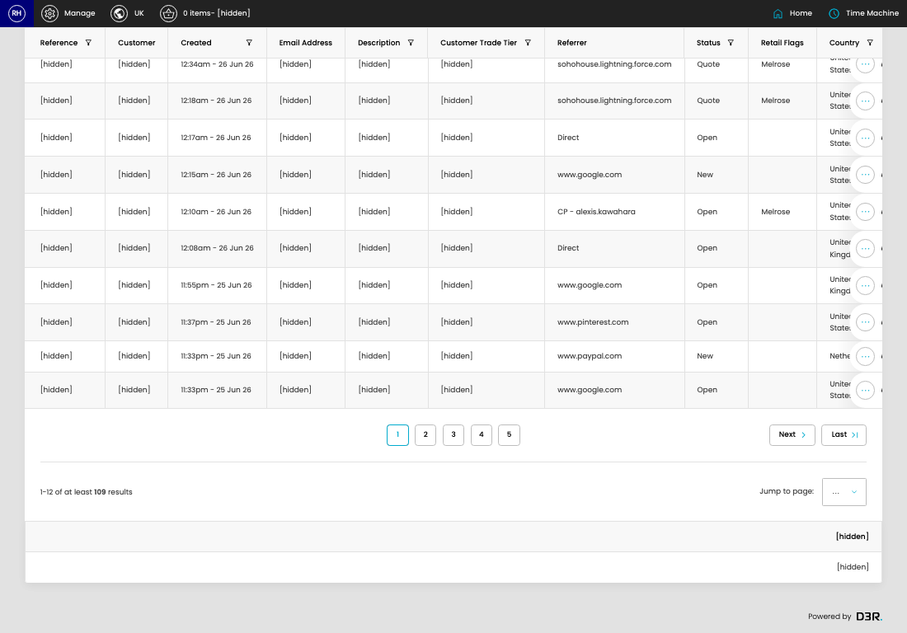
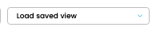

# store admin

[Home](../../index.md) / Store Admin

URL: [https://sohohome.com/cp/store-admin](https://sohohome.com/cp/store-admin)

Additional home specific store admin functionality

*store admin page overview*

## Related Pages

- [View Store Show](../002-cp-store-admin-show-id-03c4a77f/README.md): Search or filter the visible fields to find the store show you need, then open the row to check the full details.

## Using This Page

1. Open store admin from the CP navigation.
2. Search or filter until you find the store admin you need.

## What You Can Do

### Review store admin

Search or filter the visible fields to find the store admin you need.

- Field: Reference
- Field: Customer
- Field: Created
- Field: Email Address
- Field: Description
- Field: Customer Trade Tier
- Field: Referrer
- Field: Status
- Field: Retail Flags
- Field: Country
- Field: Confirmed Date
- Field: Confirmed Local Date

Example rows:

| Reference | Customer | Created | Email Address | Description | Customer Trade Tier |
| --- | --- | --- | --- | --- | --- |
| [hidden] |  | 12:56am - 26 Jun 26 |  |  |  |
| [hidden] | [hidden] | 12:52am - 26 Jun 26 | [hidden] | [hidden] |  |
| [hidden] | [hidden] | 12:34am - 26 Jun 26 | [hidden] | [hidden] | [hidden] |

## Key Settings

The sections below highlight the settings people are most likely to change.

### store admin

#### select

*select setting*

Choose the option that matches this select.

**Options:** Load saved view, AB - BKD, Austin Created, Berlin - Live, BV - Live, Chicago Weekly Sales, Dumbo Weekly Sales, Friends purchases- eCom MMW, Global E, KR - Live, Melrose Sales Yesterday, QUOTES, and 8 more

## Available Actions

- Manage saved views
