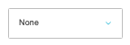
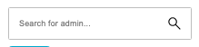

# Store Show

[Home](../../index.md) / [Store Admin](../001-cp-store-admin-998dd625/README.md) / View Store Show

URL: [https://sohohome.com/cp/store-admin/show/:id](https://sohohome.com/cp/store-admin/show/:id)

Additional home specific store admin functionality

*Store Show page overview*

## Related Pages

- [store admin](../001-cp-store-admin-998dd625/README.md): Search or filter the visible fields to find the store admin you need.

## Using This Page

1. Open Store Show from the CP navigation.
2. Search or filter until you find the store show you need.
3. Open a row when you need to check the full details.

## What You Can Do

### Review store show

Search or filter the visible fields to find the store show you need, then open the row to check the full details.

- Field: Name
- Field: SKU
- Field: Type
- Field: Status
- Field: QTY
- Field: Total

### Review an existing store show

Open an existing store show when you need to check the full details.

## Key Settings

### Store Show

#### select_retail_flag

*select_retail_flag setting*

Choose the option that matches this select_retail_flag.

**Options:** None, Amsterdam, Austin, Bicester, Berlin, Carnaby, Chicago Studio, Dumbo, Kings Road, Melrose, Miami Beach House, Nashville, and 8 more

#### Search for admin...

*Search for admin... setting*

Use the expected format shown by the placeholder: "Search for admin...".

## Available Actions

- Overview
- Adjustment History
- Payments
- Returns
- Shipments
- Notes
- Invoice
- Audit Log
- API Logs
- API Payloads
- Email Logs
- Modify items on this order
- View tax summary
- Close order
- Resend Order Confirmation
- Update Effective Prices
- Create New Basket from Order
- Send to Business Central
- Generate Sales Receipt
- Mark as Skip Stock Check
- Mark as VIP
- Mark As Interior Design
