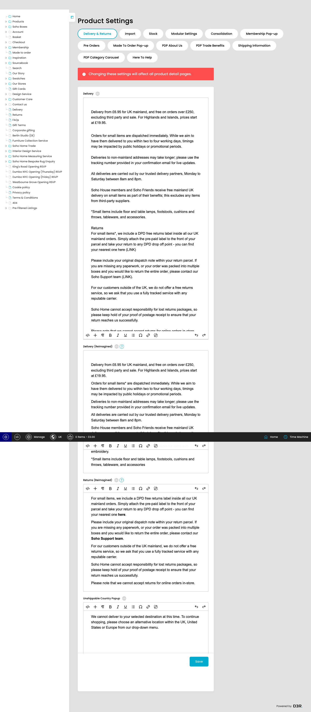

# Product Settings

This page is used to manage Product Settings. Saved values appear to be backed by Product_Settings.

*Product Settings page overview*

## Page Details

- URL: https://dev.soho-home.local/cp/product-settings-admin
- Generated: 2026-06-27T20:56:04.632Z

## Using This Page

1. Open the Product Settings page from the relevant navigation area or direct URL.
2. Review the visible sections to understand which part of the feature each setting controls.
3. Update the relevant settings, then use the page actions shown below to save or continue.

## Key Settings

This page exposes 29 detected controls. The sections below focus on the settings most likely to define the feature behaviour; the full field inventory is kept at the end for reference.

### Product Settings

#### Delivery

*Delivery setting*

Complete this field according to the page context.

**Effect:** Updates the Delivery field on Product_Settings.

**Validation:** No required marker detected.

**Stored as:** `delivery` (RichText)

**Notes:** Model XML type: RichText. Model XML dbname: delivery.

#### Delivery (Reimagined)

*Delivery (Reimagined) setting*

Complete this field according to the page context.

**Effect:** Updates the Delivery (Reimagined) field on Product_Settings.

**Validation:** No required marker detected.

**Stored as:** `pdp_delivery_content` (RichText)

**Notes:** Model XML type: RichText. Model XML dbname: pdp_delivery_content. Content just for the delivery tab for Reimagined PDP

#### Returns (Reimagined)

*Returns (Reimagined) setting*

Complete this field according to the page context.

**Effect:** Updates the Returns (Reimagined) field on Product_Settings.

**Validation:** No required marker detected.

**Stored as:** `pdp_returns_content` (RichText)

**Notes:** Model XML type: RichText. Model XML dbname: pdp_returns_content. Content just for the returns tab for Reimagined PDP

#### Unshippable Country Popup

*Unshippable Country Popup setting*

Complete this field according to the page context.

**Effect:** Updates the Unshippable Country Popup field on Product_Settings.

**Validation:** No required marker detected.

**Stored as:** `unshippable_popup` (RichText)

**Notes:** Model XML type: RichText. Model XML dbname: unshippable_popup.

## Actions And Behaviour

- Delivery & Returns
- Import
- Stock
- Modular Settings
- Consolidation
- Membership Pop-up
- Pre Orders
- Made To Order Pop-up
- PDP About Us
- PDP Trade Benefits
- Shipping Information
- PDP Category Carousel
- Here To Help
- Save

## Behaviour To Confirm

- Review vendor/soho/products/src/SettingsControllerAdmin.php for save, edit, index, and custom action behaviour.
- Review src/Products/Model/Settings.php for getters, setters, validation, save hooks, and derived behaviour.
- Review src/Products/Model/Settings.xml for field labels, types, relationships, and required settings.

## Technical References

- Controller: `Soho\Products\Base\SettingsControllerAdmin` via `product-settings-admin`
- Action: `indexAction`
- Controller file: `vendor/soho/products/src/SettingsControllerAdmin.php`
- Model: `Product_Settings` => `App\Products\Model\Settings`
- Model file: `src/Products/Model/Settings.php`
- Model XML: `src/Products/Model/Settings.xml`
- Model item prefix: `settings`

## Field Reference

| Field | Type | Stores as | Notes |
| --- | --- | --- | --- |
| Search | text |  |  |
| Jump to | datetime-local | `date` |  |
| Delivery | textarea | `delivery` | Model type: RichText |
| Rich text editor | presentation |  |  |
| p | p |  |  |
| p | p |  |  |
| Delivery (Reimagined) | textarea | `pdp_delivery_content` | Model type: RichText |
| Rich text editor | presentation |  |  |
| p | p |  |  |
| p | p |  |  |
| p | p |  |  |
| p | p |  |  |
| p | p |  |  |
| p | p |  |  |
| p | p |  |  |
| Returns (Reimagined) | textarea | `pdp_returns_content` | Model type: RichText |
| Rich text editor | presentation |  |  |
| p | p |  |  |
| p | p |  |  |
| p | p |  |  |
| p | p |  |  |
| p | p |  |  |
| Unshippable Country Popup | textarea | `unshippable_popup` | Model type: RichText |
| Rich text editor | presentation |  |  |
| p | p |  |  |
| rxCompositionCutter0 | text |  |  |
| rxCompositionCutter1 | text |  |  |
| rxCompositionCutter2 | text |  |  |
| rxCompositionCutter3 | text |  |  |
