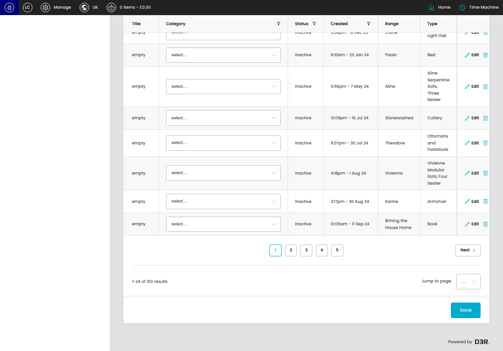
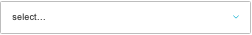
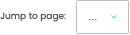

# Products

[Products overview](../../index.md) / Products Uncategorised listing

URL: [https://sohohome.com/cp/products-admin/uncategorised](https://sohohome.com/cp/products-admin/uncategorised)

Use this page to manage Products.

*Products page overview*

## Using This Page

1. Open the Products page from the relevant navigation area or direct URL.
2. Use the listing to review existing Product entries.
3. Use the available create or edit actions to manage individual entries.

## What You Can Do

### Review existing entries

Use the listing to search, filter, and review existing Product entries.

- Column: Title
- Column: Category
- Column: Status
- Column: Created
- Column: Range
- Column: Type

### Create a new entry

Select Create new to add a Product entry, then complete the labelled settings and save.

### Edit an existing entry

Open an existing Product entry to review or update its settings.

- Save applies the changes.

## Key Settings

The sections below highlight the settings people are most likely to change.

### listing-product-form

#### Product Category

*Product Category setting*

Set the Product Category value for each relevant row in this section.

**Effect:** Updates Product Category.

**Options:** Armchairs, Beds & Mattresses, Sofas, Coffee & Side Tables, Bar Cabinets & Barstools, Bedside Tables, Chest of Drawers & Wardrobes, Footstools, Ottomans & Benches, Dining Tables & Chairs, Sideboards & Media Units, Entryway, Consoles & Shelving, Wardrobes, Desks, and 17 more

#### select

*select setting*

Choose the select from the available options.

**Effect:** Updates select.

**Options:** …, 1, 2, 3, 4, 5

## Available Actions

- Create new
- Export csv
- Search
- Add filter
- Sort by Default
- Edit columns
- 2
- 3
- 4
- 5
- Next
- Save
