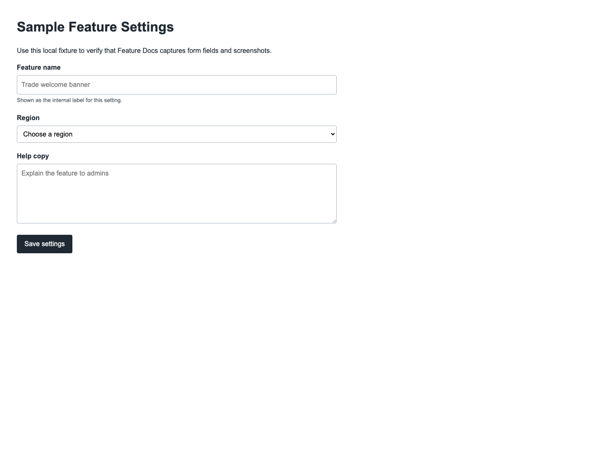
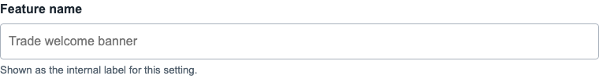
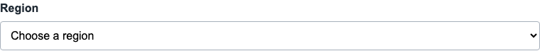
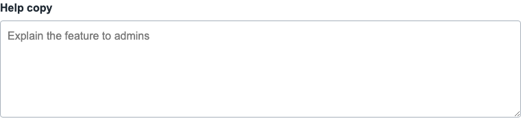

# Sample Feature Settings

Captured documentation draft for Sample Feature Settings.

*Sample Feature Settings page overview*

## Page Details

- URL: file:///Volumes/casey/shares/clients/soho-home/dev/releases/20231009091323/.vscode/feature-docs/fixtures/sample-form.html
- Generated: 2026-06-27T20:52:32.314Z

## Using This Page

1. Open the Sample Feature Settings page from the relevant navigation area or direct URL.
2. Review the visible sections to understand which part of the feature each setting controls.
3. Update the relevant settings, then use the page actions shown below to save or continue.

## Key Settings

### Sample Feature Settings

#### Feature name

*Feature name setting*

Enter a value matching "Trade welcome banner".

**Effect:** Submitted as feature_name. Read the referenced controller/model code to confirm downstream behaviour.

**Validation:** Required.

**Submitted as:** `feature_name`

**Notes:** Shown as the internal label for this setting.

#### Region

*Region setting*

Complete this field according to the page context.

**Effect:** Submitted as region. Read the referenced controller/model code to confirm downstream behaviour.

**Validation:** Required.

**Options:** Choose a region, UK, US, EU

**Submitted as:** `region`

#### Help copy

*Help copy setting*

Enter a value matching "Explain the feature to admins".

**Effect:** Submitted as help_copy. Read the referenced controller/model code to confirm downstream behaviour.

**Validation:** No required marker detected.

**Submitted as:** `help_copy`

## Actions And Behaviour

- Save settings

## Technical References

- Controller: not resolved from provider aliases.

## Field Reference

| Field | Type | Stores as | Notes |
| --- | --- | --- | --- |
| Feature name | input | `feature_name` | Required; Shown as the internal label for this setting. |
| Region | select | `region` | Required |
| Help copy | textarea | `help_copy` |  |
