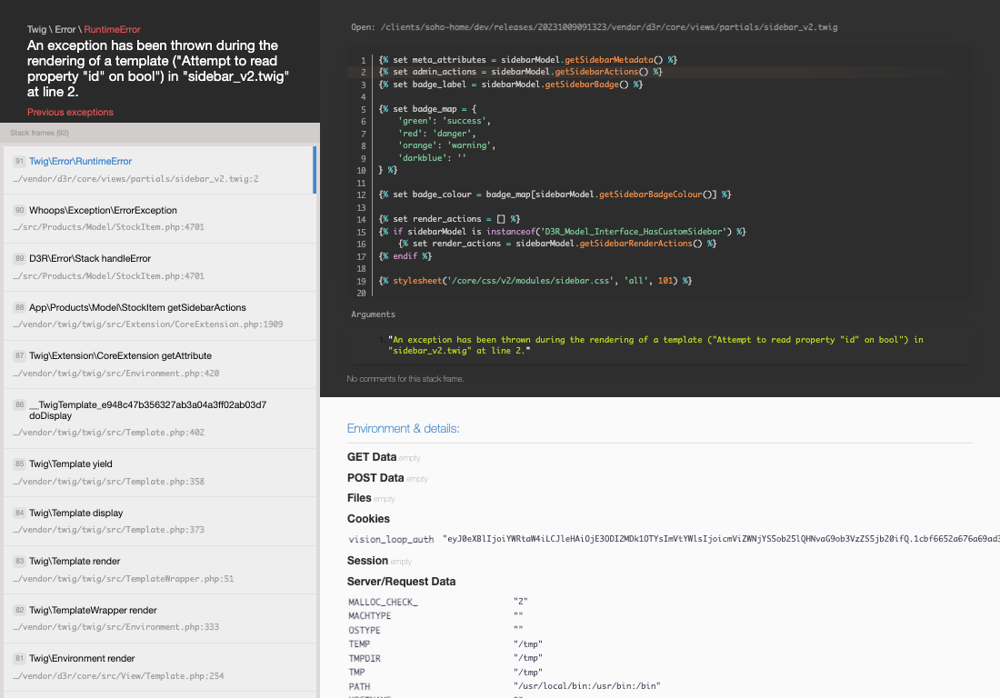

# Soho Home CP Feature Documentation

Admin listing with visual merchandising added on

*Soho Home CP Feature Documentation overview*

## What This Feature Does

- After this has been updated.
- The key fields are Item Category, Main Category, URL, Is new?, and Season, which explain what the record is for and how it can be used.
- Review the visible fields to check what already exists.
- Use Create new when this SKU does not already exist. Complete the fields that describe it, then save.

## Screens Covered

1. [Create SKU](pages/001-cp-stockitems-admin-edit-new-4e7222a9/README.md) - Review the visible fields to check what already exists.
   URL: [https://sohohome.com/cp/stockitems-admin/edit/new](https://sohohome.com/cp/stockitems-admin/edit/new)
